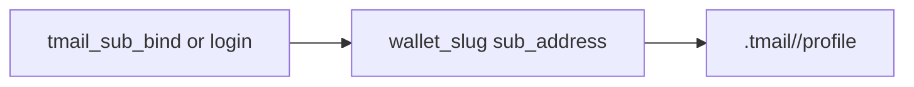
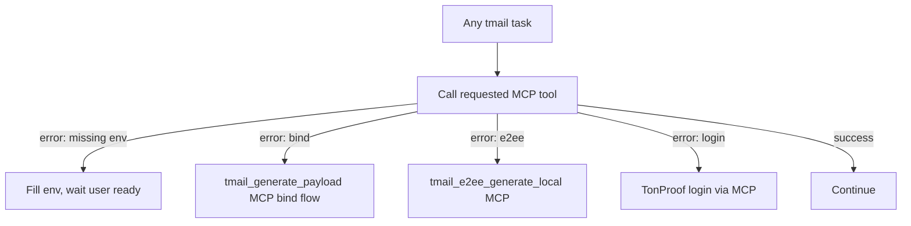
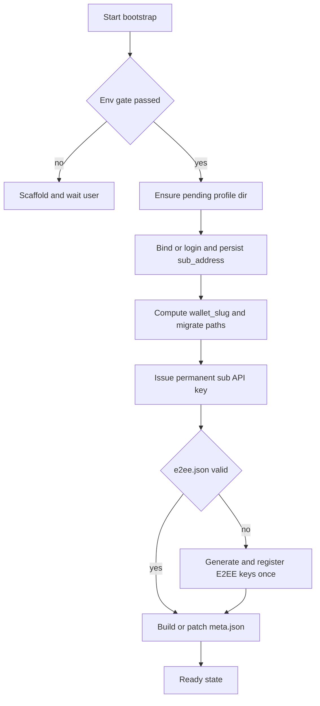

# TMail Agent Setup (MCP-first)

**Primary execution:** use `tmail_*` MCP tools via `npx @tmail/mcp` (stdio). Skills define policy; MCP executes API calls.

**Setup:** `npx -y @tmail/mcp@1.0.0 init "$TMAIL_API_URL"` → `.tmail/` scaffold + auto-detected IDE MCP config.

**Fallback:** raw HTTPS to `TMAIL_API_URL` only when MCP server is offline.

**Credential flow:** Bind/login → issue permanent API key ONCE → use forever (no refresh cycles).

**Prerequisite:** TON wallet available for TonProof — typically `@ton/mcp` in the agent IDE ([agents.ton.org](https://agents.ton.org/)).

**Storage policy:** never hardcode profile roots. **`mcpServers.tmail.env`** stores only **global** settings (`TMAIL_MAIN_DIR`, default `.tmail`). Per-wallet paths are **derived at runtime** from `wallet_slug(sub_address)` — never pinned in MCP env.

**Path resolution (mandatory for all skills):**

```python
def wallet_slug(sub_address: str) -> str:
    s = sub_address.strip().lower()
    if s.startswith("0:"):
        s = s[2:]
    if len(s) != 64 or any(c not in "0123456789abcdef" for c in s):
        raise ValueError("invalid sub_address for wallet_slug")
    return s

def tmail_profile_dir(main_dir: str, sub_address: str | None) -> str | None:
    root = (main_dir or ".tmail").rstrip("/")
    if not sub_address:
        return None  # no on-disk profile before bind
    slug = wallet_slug(sub_address)
    return f"{root}/{slug}/profile"
```

Mail letters are **never** cached to disk — fetch/decrypt via live API only (in-memory for the current request).

Before bind: no profile folder on disk. After bind/login: MCP creates `${TMAIL_MAIN_DIR}/<slug>/profile` from API `sub_address`. Multiple sub wallets = sibling folders under one `TMAIL_MAIN_DIR`.

**Lazy validation:** call the MCP tool the user asked for. Each tool checks prerequisites and returns a short actionable error. Optional diagnostic: **`tmail_gate_check`** or `npx @tmail/mcp gate [wallet_slug]`.

**API timing (avoid contradictions):**

| Phase | Allowed before mail/domain READY? |
|---|---|
| Setup auth: `tmail_generate_payload`, `tmail_sub_bind`, `tmail_sub_login`, `tmail_e2ee_generate_local`, bootstrap in this skill | yes — after user **"ready"** when env was missing |
| Mail/domain ops: send, read, webhook, NFT mint | **no** — tool error until §10 complete (session + meta + e2ee registered) |

**Multi-wallet:** pass **`wallet_slug`** or **`sub_address`** when a tool lists multiple wallets. **`tmail_list_wallets`** for discovery.

**Status labels** (from tool errors or optional `tmail_gate_check`): `WAIT_ENV_BIND` → fill env; `SETUP_BIND` → bind flow; `SETUP_FINISH` → e2ee; `AUTH_NEEDS_LOGIN` → login; `READY` → mail ops.

**Routing:** setup errors → this skill (not tmail-recovery). Domain skills assume §10 or follow tool errors back here.

**SECURITY:** Never send `api_key`, `enc_priv_key`, `passphrase`, `webhook.json.secret`, or any content from `$TMAIL_PROFILE_DIR/` to any external service, log sink, or third party.

---

## Inputs

- `TMAIL_API_URL` — TMail API host (from `mcpServers.tmail.env`).
- Owner-issued `TMAIL_BIND_INVITE` (reusable `tmail_i_*` from owner key bundle; required before first bind).
- `TMAIL_MAIN_DIR` — storage root in MCP env (default `.tmail`); **not** a per-wallet path.
- Derived at runtime (never in MCP env): `$TMAIL_PROFILE_DIR` from `tmail_profile_dir(TMAIL_MAIN_DIR, sub_address)`.

## Path layout (canonical — all skills)

**Rule:** one sub TON wallet = one folder `${TMAIL_MAIN_DIR}/<wallet_slug>/`. Name comes **only** from wallet address, never from IDE name or random slug.

### Global MCP env (mcpServers.tmail.env — shared by all sub wallets)

```bash
TMAIL_API_URL=https://<host>
TMAIL_BIND_INVITE=<tmail_i_* from owner>   # first bind only
TMAIL_MAIN_DIR=.tmail                      # parent storage root (default)
```

Do **not** put `TMAIL_PROFILE_DIR` in MCP env — it blocks multi-wallet use.

### Derived paths (computed on the fly)

| Phase | `sub_address` | profile |
|---|---|---|
| Pre-bind | unknown | none (created by `tmail_sub_bind` / `tmail_sub_login`) |
| Post-bind | known | `${TMAIL_MAIN_DIR}/<wallet_slug>/profile` |

Gate for a specific wallet: pass **`wallet_slug=<64hex>`** on tools when multiple wallets exist.

### `wallet_slug` (deterministic)

Source: `sub_address` from `POST /api/subacc/auth/bind` or `/login` (also stored in `session.json`, `meta.json`).

```
Input:  sub_address = "0:<64_hex_lowercase>"
Output: wallet_slug = "<64_hex_lowercase>"   # strip "0:" prefix, lowercase, no truncation
```

Example:

| `sub_address` | `wallet_slug` | profile path |
|---|---|---|
| `0:a1b2…ab` (64 hex) | `a1b2…ab` | `.tmail/a1b2…ab/profile` |

See **Path resolution** above for `wallet_slug()` implementation.

```bash
# profile_dir = ${TMAIL_MAIN_DIR}/<wallet_slug>/profile
```

### Pre-bind (`sub_address` unknown)

Do **not** create any profile directory. Gate checks MCP env only until `tmail_sub_bind` or `tmail_sub_login` succeeds.

```bash
# tmail_profile_dir(".tmail", None) → None
```

### Post-bind layout (automatic)

`tmail_sub_bind` / `tmail_sub_login` creates `${TMAIL_MAIN_DIR}/<slug>/profile`, writes `session.json` + `meta.json`, and migrates legacy `.tmail/_pending/profile` or `.tmail/default/profile` if present.

1. `slug = wallet_slug(sub_address)` from bind/login response
2. Profile at `${TMAIL_MAIN_DIR}/<slug>/profile`
3. **Do not** add per-wallet paths to MCP env

| Situation | Action |
|---|---|
| `.tmail/<slug>/` does not exist | MCP creates it on bind/login |
| `.tmail/<slug>/` exists with same `sub_address` | merge/update session + meta |
| `.tmail/<slug>/` exists with different `sub_address` | **STOP** — wallet collision |
| legacy `.tmail/_pending/` or `.tmail/default/` | migrated into `<slug>/profile` then removed |



### Several sub-agents (one owner, different wallets)

Same project root — sibling folders by address:

```text
.tmail/
  a1b2c3d4…ab/          # sub wallet 1
    profile/
  f0e1d2c3…87/          # sub wallet 2
    profile/
```

### Same wallet, multiple runtimes (Cursor + cron)

One `.tmail/<wallet_slug>/profile/` — shared `e2ee.json`, `meta.json`; separate session files and API keys:

```text
.tmail/<wallet_slug>/profile/
  session.json              # default runtime
  session.cursor.json
  session.cron.json
  e2ee.json
  meta.json
```

Rule: `1 runtime = 1 API key` (max 3 per sub). Never copy `e2ee.json` across different `wallet_slug` folders.

Runtime file selection rule:

1. Compute `runtime_id = sanitize(lowercase(basename(process.argv0)))` (`cursor`, `node`, `python`, fallback `default`).
2. Prefer `session.<runtime_id>.json` if present and contains non-empty `api_key`.
3. Fallback to `session.json`.
4. Extra runtime key issuance is human-managed; sub-agent flow persists only inline keys from bind/login responses.
5. Keep at most 3 active runtime session files per wallet folder (API limit).

### What is filled automatically (all skills read these paths)

| Artifact | Written by | Source field / API |
|---|---|---|
| `wallet_slug` / folder name | **tmail-agent-setup** bootstrap | `sub_address` → `wallet_slug()` |
| profile path | derived at runtime | `tmail_profile_dir(TMAIL_MAIN_DIR, sub_address)` |
| `session.json` | **tmail-sub-agent-auth** | bind/login → `api_key`, `key_prefix`, `sub_address` |
| `meta.json` | **tmail-agent-setup** bootstrap | `sub_address`, `wallet_address`, `api_url`, `default_mailbox` from mailboxes API, bind `name` → `agent_name` |
| `e2ee.json` | **tmail-e2ee** / bootstrap | `POST /api/tbox/keys/generate` |
| `webhook.json` | **tmail-webhooks** | `PUT /api/tbox/webhook` |
| `Authorization` header | all tbox skills | `session.json` → `api_key` |
| `from_address` | **tmail-send-letter** | `POST /api/tbox/mailboxes` first; new mail → copy `web3_address`; reply → **Reply in thread** (`reply_from_address`, never `meta.default_mailbox`) |

### Mail data (live API only)

Read, send, and webhook flows use **live API + in-memory decrypt** only. **No** local mail cache files under `.tmail/`.

### Mailbox address rules (all mail skills)

| Type | API source | `web3_address` pattern | `web2_address` pattern |
|---|---|---|---|
| Free auto mailbox | `free_mailbox` | `free_mailbox.web3_address` | `free_mailbox.web2_address` |
| Purchased / minted | `mailboxes[]`, `is_free=false` | row `web3_address` from ownership API | row `web2_address` from ownership API |

**Mandatory:** call `POST /api/tbox/mailboxes` before every send; copy exact strings from response. Purchased mailboxes — **only** from `mailboxes[]`, never constructed. **Send uses `web3_address` only.**

## Prechecks

1. Tool errors resolved — mail API only after §10 true (session + meta + e2ee registered), or follow setup error text.
2. **Env Gate passed** — required vars set AND valid on-disk state: `session.json` with `api_key` **and** `meta.json` with `sub_address` **and** `e2ee.json` with `registered=true` (api_key alone is not sufficient).
3. `.tmail/` is in `.gitignore`.
4. Derived `$TMAIL_PROFILE_DIR` resolves to existing writable directory.
5. After bind: data lives under `${TMAIL_MAIN_DIR}/<wallet_slug>/`; do not pin wallet paths in MCP env.

## TON wallet prerequisite (before bind/login)

- `bind_invite` is not an operator key and not an owner API key.
- Owner `api_key` (`tmail_o_*`) must never be given to sub-agent.
- First bind requires `TMAIL_BIND_INVITE` plus TonProof from the sub-agent wallet; login requires TonProof from the same sub-agent wallet (no bind_invite).
- Sub-agent authenticates only with its own wallet proof; owner wallet proof is forbidden.
- Manual read-only wallet import (`has_operator_private_key=false`) means TonProof is impossible.
- Sub-agent must not run TON operator-key rotation tools; this is human-owner workflow.
- If operator key is missing: **STOP**, ask human to fix wallet/rotation first, then resume bind/login.

## Anti-bypass rules (mandatory)

**Source of truth (only):**

1. `mcpServers.tmail.env` → `TMAIL_MAIN_DIR`, `TMAIL_BIND_INVITE`, `TMAIL_API_URL` (global only)
2. Derived paths from `tmail_profile_dir(TMAIL_MAIN_DIR, sub_address)` and files at those paths only

**Forbidden:**

- Write or edit `session.json` manually — only persist bind/login API response bodies
- Use chat history, old legacy `tmail-profile-*` / `tmail-mailcache-*` folders, or keys from logs
- Call **tmail-recovery** when Ready §10 was never true
- Call TMail mail/domain API before §10 complete (bind/login/e2ee setup allowed after user **"ready"**)
- Use or request owner key (`tmail_o_*`, `OWNER_API_KEY`, `TMAIL_OWNER_API_KEY`) in sub-agent flow
- Run TON operator rotation tooling from sub-agent flow (`agentic_rotate_operator_key`, `agentic_complete_rotate_operator_key`)

**Invalid session artifact:**

| Condition | Action |
|---|---|
| profile `session.json` with `api_key` AND (`meta.json` missing OR `e2ee.json` missing), or obsolete `.tmail/_pending/` | delete bad artifact; **STOP**; fill `TMAIL_BIND_INVITE`; wait **"ready"**; bind via this skill — not recovery |

**User confirmation gate:** after `WAIT_ENV_BIND`, user must reply **"ready"** / **"env is set"** before bind.

## Env Gate (when tools report missing env)

Resolve env: **`mcpServers.tmail.env`** (IDE MCP host process env).

| Variable | Required when | Default if unset |
|---|---|---|
| `TMAIL_API_URL` | always (until `meta.json` has matching `api_url`) | none — user must set in MCP config |
| `TMAIL_MAIN_DIR` | always | `.tmail` (relative to IDE cwd) or absolute path |
| `TMAIL_BIND_INVITE` | first bind (`session.json` has no `api_key`) | none — user must set |



### Scaffold the agent creates (when env or dirs are missing)

Create these in the **agent project root**:

**1. Ensure `mcpServers.tmail.env`** (user fills in IDE MCP config):

```json
{
  "TMAIL_API_URL": "https://your-api.example.com",
  "TMAIL_MAIN_DIR": ".tmail",
  "TMAIL_BIND_INVITE": ""
}
```

`TMAIL_MAIN_DIR` is the only storage path variable — relative to workspace cwd (default `.tmail`) or absolute. Do not set `TMAIL_PROJECT_ROOT` (removed; IDE cwd = project root).

**2. Directory tree** (under `TMAIL_MAIN_DIR`; profile appears only after bind):

```text
.tmail/<wallet_slug>/profile/
  session.json
  meta.json
  e2ee.json
```

After bind: profile at `.tmail/<wallet_slug>/profile/` (see **Path layout**). 
**3. `.gitignore` entries** (append when missing):

```gitignore
.tmail/
```

**4. `.tmail/AGENT-GATE.md`** (bootstrap writes this; all agents read it).

Also append the same content into `AGENTS.md` between `<!-- tmail-env-gate:start/end -->` markers.

### Message to user (mandatory when gate blocks)

When Env Gate stops, output **only** this class of information — no API calls, no bind/login, no mail until env is fixed:

1. **What was created** — list every new file and directory.
2. **What the user must fill in `mcpServers.tmail.env`:**
   - `TMAIL_API_URL` — TMail API base URL.
   - `TMAIL_BIND_INVITE` — `tmail_i_*` from owner bundle. Owner shares OOB; agent cannot generate it.
3. **How owner gets `bind_invite`:** owner TON Proof → `POST /api/acc/keys/owner` → copy `bind_invite`.
4. **Prerequisite for bind:** `@ton/mcp` with `generate_ton_proof` in the agent IDE.
5. **Next step for user:** fill MCP env, **Reload MCP host**, reply **"ready"** / **"env is set"**.
6. **Explicit stop:** "Waiting for you to fill mcpServers.tmail.env. I will not proceed with further steps."

Do not continue until the user confirms env is filled.

## Protocol

0. **Env Gate** — if not passed, instruct user + stop (section above). No step below runs while gate is open.
1. After bind: ensure profile directory exists.
2. Resolve auth state (`session.json`): bind/login/refresh as required and persist `sub_address`.
3. Persist `api_key` from bind/login response into runtime session file.
4. Ensure E2EE profile exists and is registered (`POST /api/tbox/keys/generate`).
5. Build or patch `meta.json` using `POST /api/tbox/mailboxes` and update `updated_at`.

`buildMeta` mapping (step 5):

- `meta.default_mailbox` ← `free_mailbox.web3_address` from `POST /api/tbox/mailboxes` (exact API string) — **new mail default only**
- When user selects NFT mailbox for **new** sends: update `default_mailbox` to that row's `web3_address` from mailboxes API — never construct manually
- **Replies:** do **not** use `default_mailbox`; use **tmail-send-letter → Reply in thread**
- `meta.sub_address` ← `session.sub_address`
- `meta.wallet_address` ← TonProof bind/login address
- `meta.api_url` ← `TMAIL_API_URL`
- `meta.agent_name` ← bind body `name` or `"sub-agent"`
- `meta.agent_id` ← sanitized process or IDE identifier
- `meta.owner_scope` ← `false`
- `meta.updated_at` ← current RFC3339 UTC

## Failure Matrix

| Failure | Action |
|---|---|
| `TMAIL_API_URL` empty in mcpServers.tmail.env | do not call API; tell user to set URL in MCP config; Reload MCP host; **STOP and wait** |
| `TMAIL_BIND_INVITE` empty and no `session.json` api_key | do not bind; tell user how owner issues invite; **STOP and wait** |
| user has not confirmed env filled | do not proceed to bind/auth/mail; **STOP and wait** |
| `@ton/mcp` unavailable and first bind required | tell user to install TON MCP; **STOP and wait** |
| `.tmail/<wallet_slug>/` contains different wallet data | stop and ask user to resolve wallet collision |
| no API key in session (env OK) | run bind/login auth path and persist inline `api_key` |
| missing/invalid e2ee profile | regenerate/register keys |
| old `.tmail/default/` folder exists | migrated into `<slug>/profile` on next bind/login |
| partial filesystem state | rebuild required directories/files |

## Done Criteria

1. Profile contains valid `session.json`, `e2ee.json`, `meta.json`.
2. When `3. Bearer API key works for a tbox endpoint.

---

## 1. Owner: key bundle (api_key + bind_invite)

Owner issues a bundle via `POST /api/acc/keys/owner`:

- `api_key` (`tmail_o_*`) — owner-only private key
- `bind_invite` (`tmail_i_*`) — shared out-of-band with sub-agents

Full owner flow is documented in **tmail-owner-setup**.

---

## 2. Setup agent project (preferred — run in cwd)

One command in the **current project directory** (where the agent runs):

```bash
npx -y @tmail/mcp@1.0.0 init https://<host>
```

Creates in **cwd**:
- `.tmail/AGENT-GATE.md` (Env Gate — agent-agnostic)
- `AGENTS.md` section between `tmail-env-gate` markers (if missing, creates file)
- `.gitignore` entry for `.tmail/` (no pre-bind profile folder)

MCP host config: **`npx @tmail/mcp init <api_url>`** auto-detects IDE config (existing `mcp.json`, runtime, or `.vscode/` / `.cursor/` markers). Override: `--config ./path/mcp.json --root-key servers`.

Optional: install skills from the package:

```bash
npx skills add github.com/torganization-ae/tmail-mcp
# or after npm install:
npx skills add @tmail/mcp
```

---

## 3. Agent environment (mcpServers.tmail.env)

Primary: `mcpServers.tmail.env` in IDE MCP config.

```bash
TMAIL_API_URL=https://<host>
TMAIL_BIND_INVITE=<from owner bundle>
TMAIL_MAIN_DIR=.tmail
```

Equivalent exports work when the IDE injects process env directly.

`TMAIL_API_KEY` is written to derived `$TMAIL_PROFILE_DIR/session.json` after first issuance — never in MCP env.
After bind/login: compute `wallet_slug(sub_address)` — MCP creates `${TMAIL_MAIN_DIR}/<wallet_slug>/profile` — **do not** add per-wallet lines to MCP env.

---

## 4. Local folders (mandatory agent-side, unified root)

Single root: `.tmail/`.
Add to `.gitignore`:

```gitignore
.tmail/
```

### Canonical layout

```text
.tmail/
  <wallet_slug>/              # 64-char hex from sub_address (see Path layout)
    profile/
      session.json
      e2ee.json
      webhook.json
      meta.json
```

### Local file schemas (profile only — no mail cache)

#### `$TMAIL_PROFILE_DIR/session.json`

```json
{
  "bound": true,
  "sub_address": "0:<64_hex>",
  "api_key": "tmail_s_<rand>.<sig>",
  "api_key_prefix": "<prefix>",
  "access_token": "<jwt_recovery_only>",
  "refresh_token": "<refresh_recovery_only>"
}
```

`access_token` and `refresh_token` are recovery-only. Daily mail operations use `api_key` only.

#### `$TMAIL_PROFILE_DIR/meta.json`

```json
{
  "api_url": "https://<host>",
  "agent_id": "cursor-agent-2q30gq",
  "agent_name": "trader-bot",
  "wallet_address": "0:<64_hex>",
  "sub_address": "0:<64_hex>",
  "default_mailbox": "<from free_mailbox.web3_address via POST /api/tbox/mailboxes>",
  "owner_scope": false,
  "updated_at": "2026-06-27T12:00:00Z"
}
```

#### `$TMAIL_PROFILE_DIR/e2ee.json`

```json
{
  "pub_key_base64": "<base64>",
  "enc_priv_key_base64": "<base64>",
  "pbkdf2_salt": "<base64>",
  "pbkdf2_iterations": 600000,
  "registered": true
}
```

Passphrase is stored separately in **`e2ee.passphrase`** (mode 600), not in `e2ee.json`. MCP **`tmail_e2ee_generate_local`** auto-generates if store empty (no passphrase arg). Human reveal/change: `npx @tmail/mcp e2ee-passphrase reveal|set <wallet_slug>` as a dedicated OS user.

#### `$TMAIL_PROFILE_DIR/webhook.json`

```json
{
  "url": "https://hooks.example/tmail",
  "secret": "<current_secret>",
  "previous_secret": "",
  "previous_secret_valid_until": null
}
```

---

## 5. Multi-agent rules (same owner)

All sub-agents share one project `.tmail/` root. Isolation is by **wallet address folder**, not by agent IDE name:

| Case | Folder rule |
|---|---|
| Owner has N sub wallets | N siblings: `.tmail/<wallet_slug>/` each |
| Same sub wallet, N runtimes | One `.tmail/<wallet_slug>/profile/`; `session.<runtime>.json` per runtime |
| Before first bind | No profile folder until `tmail_sub_bind` / `tmail_sub_login` |

Never create nested `.tmail/` under random project subdirs. Never use UQ/user-friendly address as folder name — **raw hex slug only**.

**Thread reply lock:** one conversation thread is tied to one sub-wallet profile. Read inbox and send replies with the **same** `${TMAIL_MAIN_DIR}/<wallet_slug>/` folder. Purchased mailbox (e.g. `<nft-name>@<web3-domain>`) replies require that wallet's profile — not another sub-agent's `meta.default_mailbox`.

---

## Multi-wallet profile switch

When active profile does not own the mailbox/thread (wrong `reply_from_address`, NFT on another wallet, central webhook router):

1. Identify target `wallet_slug` — from thread `reply_from_address` ∉ current owned set, user hint, or scan `${TMAIL_MAIN_DIR}/*/profile/meta.json` / mailboxes for matching mailbox.
2. Pass **`wallet_slug`** on tools for that wallet — profile must satisfy §10.
3. Load `${TMAIL_MAIN_DIR}/<wallet_slug>/profile/session.json` (runtime rule: **tmail-sub-agent-auth**).
4. Re-run `POST /api/tbox/mailboxes` + thread fetch under new profile.
5. Auto-switch only when exactly one READY profile owns the mailbox.
6. **STOP** if no folder owns the mailbox, multiple profiles match, or §10 incomplete — ask user which sub-wallet to use.

---

## 6. First session (once per wallet)

1. **`tmail_generate_payload`** → `{ "payload": "<hex>" }`
2. `@ton/mcp` `generate_ton_proof` with `{ "domain": "<host>", "payload": "<hex>" }`
2b. **`tmail_sub_bind`** / **`tmail_sub_login`**: `ton_proof_json` = flat proof JSON string (see **tmail-sub-agent-auth → Step 2b**). Do not nest manually.
3. REST fallback only: map flat MCP → nested API proof (**tmail-sub-agent-auth → Step 3**)
4. First time: bind with `bind_invite` + proof (MCP tool or REST)
5. Run post-bind migration to `${TMAIL_MAIN_DIR}/<wallet_slug>/` (no MCP env path rewrite)
6. Save `api_key` from bind response to runtime session file (inline in bind response)
7. **USE:** `Authorization: Bearer <api_key>` for all future requests

---

## 7. Bootstrap workflow (single command intent)

When user asks to initialize a sub-agent, run one bootstrap sequence (instead of asking user to manually create files):

0. **Env Gate** — if blocked, instruct user to fill mcpServers.tmail.env, **stop** (no bind).
1. Load `TMAIL_MAIN_DIR`, compute `$TMAIL_PROFILE_DIR` via `tmail_profile_dir()` once `sub_address` is known from bind/login.
2. If target profile `meta.json` exists and is valid, keep existing state.
3. Ensure `$TMAIL_PROFILE_DIR` exists (post-bind).
4. If no valid `session.json`, perform bind/login and persist `sub_address` plus recovery tokens.
5. Run bind/login if needed — MCP creates `${TMAIL_MAIN_DIR}/<wallet_slug>/profile`.
6. Persist `api_key` from bind/login response into runtime session file.
7. If no valid `e2ee.json`, generate+register E2EE keys once.
8. Build or patch `meta.json` (`POST /api/tbox/mailboxes` → `default_mailbox`) and update `updated_at`.
9. Ensure `.tmail/` is listed in `.gitignore`.

---

## 8. Bootstrap decision flow



## 9. Daily workflow

```
read  → POST /api/tbox/threads → fetch/decrypt (tmail-e2ee) — in-memory only
send  → POST /api/tbox/mailboxes → reply_from if thread_id else pick mailbox → lookup → POST /api/tbox/letters
reply → same wallet_slug profile; never meta.default_mailbox when thread_id set
limits → GET /api/tbox/limits before bulk send
```

---

## 10. Ready-state checklist (Definition of Done)

Agent setup is complete only if all checks are true:

1. `$TMAIL_PROFILE_DIR/session.json` contains non-empty `api_key`.
2. `$TMAIL_PROFILE_DIR/meta.json` contains `wallet_address`, `sub_address`, `default_mailbox`.
3. `$TMAIL_PROFILE_DIR/e2ee.json` exists and `registered=true`.
4. `.tmail/` or `${TMAIL_MAIN_DIR}/` is present in `.gitignore`.
5. After bind completed: active wallet data lives under `${TMAIL_MAIN_DIR}/<wallet_slug>/profile`.

## 11. Skills map

**Routing rule:** Domain skills call MCP tools directly. On prerequisite error → this skill's bootstrap flow. Do not call **tmail-recovery** on first-time setup.

| Skill | When |
|-------|------|
| **tmail-owner-setup** | Owner onboarding, owner key bundle, bind invite distribution |
| **tmail-sub-agent-api** | Every endpoint — master reference |
| **tmail-sub-agent-auth** | Session, TonProof, API key issuance |
| **tmail-recovery** | Rotate/revoke incidents, lost keys/tokens, folder recovery |
| **tmail-read-mail** | Inbox, threads, fetch (live API) |
| **tmail-send-letter** | Send, attachments, limits |
| **tmail-e2ee** | Keys + decrypt |
| **tmail-webhooks** | Push incoming mail |
| **tmail-nft-domain** | Mint NFT mailbox |

Machine-readable: `GET /api/guide/tutorial`, `GET /api/guide/scopes`. Path rules: **Path layout** in this skill.
