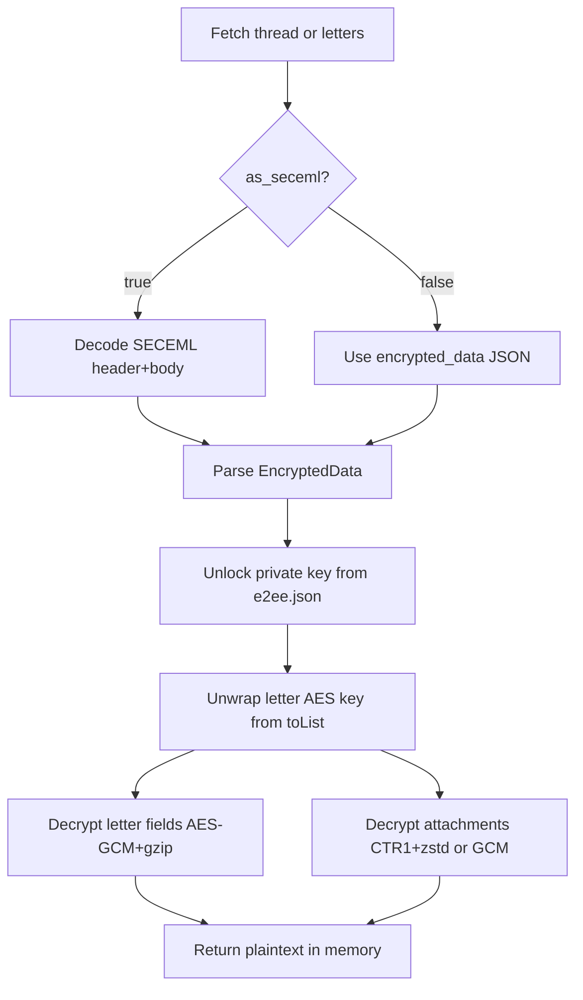
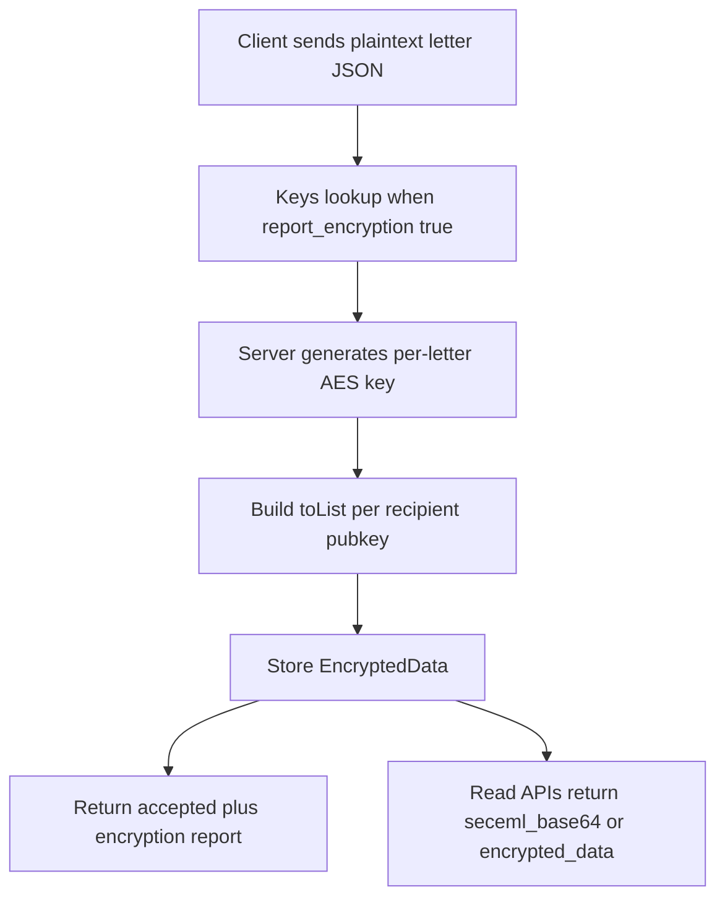

# TMail E2EE (REST, protocol-level)

**Lazy validation:** call MCP tools directly — errors say what's missing (env, bind, e2ee, wallet_slug). Decrypt/read flows need §10 complete. See **tmail-agent-setup**.

This skill is the exact protocol guide for E2EE in TMail (no abstract wording).

- Key management API: MCP `tmail_e2ee_*` tools → REST `/api/tbox/keys/*` (see OpenAPI on your `TMAIL_API_URL`)
- SecEML binary format: `POST /api/tbox/threads/letters` with `as_seceml: true` (see §5 below)
- Local keygen/decrypt: MCP `tmail_e2ee_generate_local` (auto-generates passphrase in `e2ee.passphrase`; never in `e2ee.json` or tool output)

## Inputs

- `api_key` for REST calls.
- **`wallet_slug`** (required for `tmail_e2ee_generate_local` / `tmail_e2ee_register`) — from bind response or `tmail_list_wallets`. Never omit on strict E2EE ops.
- `$TMAIL_PROFILE_DIR/e2ee.json` with `pub_key_base64`, `enc_priv_key_base64`, `pbkdf2_salt`, `pbkdf2_iterations`. (`$TMAIL_PROFILE_DIR` = derived `.tmail/<wallet_slug>/profile`, **not** `TMAIL_PROFILE_DIR` env.)
- Mail payload from read API: `seceml_base64` or `encrypted_data`.
- Paths from `$TMAIL_MAIN_DIR` + `wallet_slug(sub_address)` → `$TMAIL_PROFILE_DIR` via `tmail_profile_dir()`.

## Prechecks

1. §10 complete for active `wallet_slug` — otherwise tool error with next step. See **tmail-agent-setup → API timing**.
2. Setup bootstrap step for E2EE: **`tmail_e2ee_generate_local(wallet_slug=..., register=true)`** — no passphrase arg (auto-generate → `e2ee.passphrase`); writes `e2ee.json` locally **before** PUT `/api/tbox/keys`. Human reveal: `npx @tmail/mcp e2ee-passphrase reveal <slug>`.
3. `GET /api/tbox/keys` returns non-empty `pub_key_e2e`.
4. Local unlocked private key matches local public key.
5. For encrypted letter, `toList[my_pub_key_base64]` exists.
6. Mail/domain decrypt flows only when §10 complete; bind/login/e2ee-register may run earlier per **tmail-agent-setup → API timing**.

## Protocol

0. **On tool error** — follow actionable message (env / bind / e2ee / wallet_slug). See **tmail-agent-setup → API timing**.
1. Parse read payload (`as_seceml:true` -> decode SecEML, else use `encrypted_data`).
2. Unlock private key from `e2ee.json` (PBKDF2 using `pbkdf2_iterations` from file — currently **600000** — + AES-GCM).
3. Unwrap letter AES key from `toList` (NaCl + PBKDF2 10000).
4. Decrypt text fields (AES-GCM + gzip fallback).
5. Decrypt attachments (`CTR1+AES-CTR+zstd`, fallback GCM format).
6. Return decrypted fields in memory only — **never** write letter bodies to disk.

## Failure Matrix

| Failure | Action |
|---|---|
| Missing `toList[my_pub]` | Mark as encrypted-not-decryptable for current identity |
| PBKDF2/secretbox unwrap error | Keep encrypted payload unchanged |
| Field decrypt error | Keep metadata, set encrypted-body state |
| Attachment decrypt error | Keep letter decrypted, mark attachment failed |

## Done Criteria

1. Decrypted `subject/plain/html` are readable in the tool response.
2. No private key or unwrapped AES key leaked to logs.
3. No mail content written under `.tmail/` — in-memory only.

## Client integration layers

| Layer | Responsibility |
|---|---|
| Session | Restore/persist key presence and account binding |
| Key storage | Per-account encrypted blob persistence (local profile only) |
| Decrypt orchestration | Letter fields, attachments, and encryption flags |
| Crypto engine | PBKDF2, NaCl box, AES-GCM/CTR (see §4–§6 below) |

## 1) Trust boundaries (what encrypts where)

- Server encrypts outgoing letter payload for recipients in the server mail pipeline.
- Server never decrypts incoming letters for client UI.
- Client decrypts fields and attachments using local private key + `toList`.
- Private key stays client-side (`e2ee.json` in profile). Do not send it to API.

## 2) Prefixes and identifiers

| Prefix | Meaning | Usage |
|---|---|---|
| `is-` | Content ID prefix | Strip before PBKDF2 salt in letter key unwrap |
| `bs-` | Blob ID prefix | Strip before PBKDF2 salt in letter key unwrap |

`cleanMessageId = messageId` without `is-`/`bs-` prefix.

## 3) Key registration protocol

### Generate + register (MCP-first)

**Preferred:** MCP tool `tmail_e2ee_generate_local` — omit passphrase (auto-generate to `e2ee.passphrase`); optional `register: true` calls `PUT /api/tbox/keys`. Do **not** pass passphrase via MCP tool args.

Persist `$TMAIL_PROFILE_DIR/e2ee.json` (no passphrase field) and `e2ee.passphrase` with `0600`.

### Validate key exists on server

```http
GET /api/tbox/keys
Authorization: Bearer <api_key>
```

Must return non-empty `pub_key_e2e`.

## 4) Private key unlock protocol (client local)

1. `passphrase = read e2ee.passphrase file` (or `TMAIL_E2EE_PASSPHRASE` env fallback — not from `e2ee.json`).
2. `salt = base64_decode(pbkdf2_salt)`.
3. `derived = PBKDF2-HMAC-SHA256(passphrase, salt, e2ee.json.pbkdf2_iterations, 32)`.
4. `ciphertext = base64_decode(enc_priv_key_base64)`.
5. AES-256-GCM decrypt with:
   - nonce: first 12 bytes of ciphertext
   - AAD: `nil`
   - payload: remaining bytes
6. Result must be 32-byte Curve25519 private key.
7. Re-derive public key locally and ensure it equals `pub_key_base64`.

If pub mismatch: reject profile as corrupted/wrong passphrase.

## 5) Read API wire formats

### Path A: `as_seceml: true` (binary SecEML container)

```http
POST /api/tbox/threads/letters
{ "thread_id": "<id>", "as_seceml": true, "offset": 0, "limit": 0 }
```

`offset`/`limit` are optional MCP-side paging params (default `0` = all letters). Use for long threads.

`seceml_base64` decodes to binary format:

- bytes `0..5`: ASCII `SECEML`
- byte `6`: version `0x01`
- byte `7`: kind (`0x01` encrypted JSON, `0x02` plain EML)
- bytes `8..47`: reserved (40 bytes)
- bytes `48..51`: big-endian uint32 body length
- bytes `52..`: body payload

For E2EE letters, kind must be `0x01`, body is JSON `EncryptedData`.

### Path B: `as_seceml: false` (already JSON)

API returns `encrypted_data` object directly (`version`, `uuid`, `data`, `toList`).

## 6) `EncryptedData` and `toList` exact layout

`EncryptedData` fields:
- `uuid`: prefixed message/storage id (`is-...` or `bs-...`)
- `data`: encrypted `BaseDataLetter` fields
- `toList`: map `recipientPubKeyBase64 -> wrappedAesBlob`

`toList[recipientPub]` exact structure:

1. Base64 decode `toList` value.
2. Decoded bytes are UTF-8 string:  
   `ephemeral_sender_pub_b64 + "<:>" + enc_aes_shared_b64`
3. Split once by `"<:>"`.

Split once by `"<:>"` (TMail wire format; covered by MCP E2EE tests).

## 7) Letter AES key unwrap protocol (critical part)

Given:
- recipient private key (32 bytes)
- recipient public key (base64) to index `toList`
- message id / uuid

Steps:

1. Get `entry = toList[myPubKeyBase64]`.
2. Decode and split entry by `"<:>"` into:
   - `ephemeralPubB64`
   - `encAesSharedB64`
3. `ephemeralPub = base64_decode(ephemeralPubB64)` (32 bytes).
4. Compute shared secret: `shared = nacl.box.before(ephemeralPub, myPrivateKey)`.
5. `cleanMessageId = messageId` without `is-`/`bs-`.
6. `derived = PBKDF2-HMAC-SHA256(shared, utf8(cleanMessageId), 10000, 32)`.
7. Decrypt `encAesSharedB64` via NaCl SecretBox:
   - decode base64 to bytes
   - nonce = first 24 bytes
   - ciphertext = rest
   - key = `derived`
8. SecretBox plaintext is base64 string of letter AES key.
9. Decode plaintext base64 -> 32-byte AES key.

## 8) Field decrypt protocol

Encrypted string fields (`subject`, `from`, `htmlText`, `plainText`, `to[]`, etc.) use:

1. `raw = base64_decode(fieldCiphertext)`
2. nonce = first 12 bytes
3. ciphertext = rest
4. AES-256-GCM decrypt (`AAD=nil`)
5. Try gzip decompress; if not gzip, use plaintext bytes directly
6. UTF-8 decode string

Frontend reference: `crypto-core.ts` `decryptFieldCore()`.

## 9) Attachment decrypt protocol

Primary attachment format:
- header `"CTR1"` (4 bytes) + IV (16 bytes) + ciphertext
- decrypt via AES-CTR (counter = IV, length 128)
- output is zstd-compressed payload; decompress via zstd

Fallback GCM format:
- AES-GCM: nonce 12 bytes + ciphertext

Frontend reference: `crypto-core.ts` `decryptAttachmentCtrZstd()` and `decryptAttachmentGcm()`.

## 10) End-to-end working read flow



## 10.1) End-to-end working send flow

**Note:** diagram below is **server-side encryption on accept** — not agent send steps. Agent send protocol: **tmail-send-letter**.



## 11) Minimal reproducible pseudo-code

```text
ed = get_encrypted_data(letter, as_seceml=true|false)
priv = unlock_private_key(read_e2ee_passphrase_file(), enc_priv_key_base64, pbkdf2_salt, e2ee.json.pbkdf2_iterations)
entry = ed.toList[my_pub_key_b64]
ephemeral_pub_b64, enc_aes_shared_b64 = split(base64_decode(entry), "<:>", 1)
shared = nacl_box_before(base64_decode(ephemeral_pub_b64), priv)
salt = strip_prefix(ed.uuid or ed.data.messagesID, ["is-", "bs-"])
derived = pbkdf2_sha256(shared, utf8(salt), 10000, 32)
aes_key_b64 = nacl_secretbox_open_b64(enc_aes_shared_b64, derived)
aes_key = base64_decode(aes_key_b64)
subject = decrypt_field_aes_gcm_gzip(ed.data.subject, aes_key)
plain = decrypt_field_aes_gcm_gzip(ed.data.plainText, aes_key)
```

## 12) Common hard failures and exact fixes

| Symptom | Root cause | Fix |
|---|---|---|
| `CryptoError` on `box/secretbox open` | wrong `toList` parsing (not split by `<:>`) | decode base64 -> split string once by `<:>` |
| unwrap fails for `is-*` letter IDs | message salt includes prefix | strip `is-`/`bs-` before PBKDF2 |
| field decrypt fails with valid AES key | wrong nonce length | use 12-byte nonce for field AES-GCM |
| attachment decrypt fails | trying GCM on new format | detect `CTR1` and use AES-CTR + zstd first |
| pub key mismatch after unlock | wrong passphrase or corrupted `e2ee.json` | re-unlock and verify pub before decrypt |

## 13) Operational requirements

- Never log raw `e2ee.json`, passphrase, private key, or unwrapped AES key.
- Cache decrypted letters locally to avoid repeated decrypt cost.
- On missing `toList[myPub]`, mark letter as encrypted but not decryptable for this identity.

For API schemas and endpoint payloads: see `tmail-sub-agent-api`.
