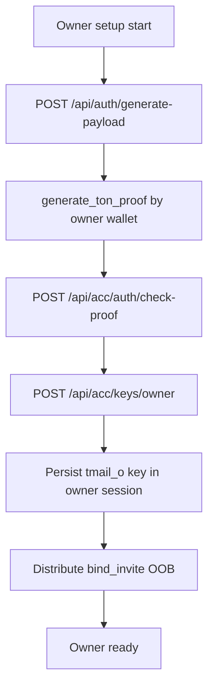

# TMail Owner Setup (REST)

Owner flow is separate from sub-agent flow. Owner authenticates with TonProof, issues owner key bundle once, and distributes `bind_invite` to sub-agents out-of-band.

`tmail_o_*` and `bind_invite` are secrets. Never send them to logs or external systems.

---

## Inputs

- `TMAIL_API_URL`.
- TON proof data from `@ton/mcp generate_ton_proof`.
- Owner wallet address (raw `0:<64_hex>`).
- Path storage under `.tmail/<wallet_slug>/` using the same `wallet_slug()` rule from **tmail-agent-setup**.

## Prechecks

1. Env Gate from **tmail-agent-setup** passed (`TMAIL_API_URL` set).
2. TON Proof payload generated by `POST /api/auth/generate-payload`.
3. Owner storage path exists or can be created.
4. Existing active owner key state is known (`POST /api/acc/keys/owner` may return 409 if already issued).

## Protocol

1. Generate payload via `POST /api/auth/generate-payload`.
2. Sign payload with owner wallet through `@ton/mcp`.
3. Authenticate owner via `POST /api/acc/auth/check-proof`, receive owner JWT + refresh token.
4. Issue owner key bundle via `POST /api/acc/keys/owner` using owner JWT.
5. Persist owner `api_key` in owner session file under `.tmail/<owner_wallet_slug>/profile/`.
6. Share `bind_invite` out-of-band to each sub-agent operator for `TMAIL_BIND_INVITE`.
7. Use owner key (`tmail_o_*`) for owner mail and subaccounts management operations.
8. **Revoke sub:** `DELETE /api/subaccounts/{address}` — deactivates sub, revokes all sub API keys and refresh tokens; sub stays in list with `is_active:false`. Sub-agent must **re-bind** (not login) to reactivate.
9. **Purge sub (irreversible):** after revoke, `POST /api/subaccounts/{address}/purge` with `{ "acknowledge_irreversible_data_loss": true }` — permanently deletes mail and server-side account data; bind afterward creates a clean wallet.
10. For rotate/revoke owner key operations, switch to **tmail-recovery**.



## Failure Matrix

| Failure | Action |
|---|---|
| `check-proof` returns 401 | regenerate payload and sign again without mutating `domain.value` |
| `POST /api/acc/keys/owner` returns 409 | owner key already exists; use **tmail-recovery §OwnerRotate** if reissue is required |
| owner key bundle leaked | immediately execute **tmail-recovery §OwnerRotate** |
| cannot persist owner session file | stop; do not continue with partial owner state |
| bind_invite delivery channel unavailable | stop and wait; do not expose invite in plaintext logs |

## Done Criteria

1. Owner session file contains non-empty `api_key` with `tmail_o_*` prefix.
2. `bind_invite` from owner bundle is captured for OOB distribution.
3. Owner-authenticated request succeeds with `Authorization: Bearer <tmail_o_*>`.

## API Examples

```http
POST /api/acc/auth/check-proof
Content-Type: application/json

{
  "address": "0:<owner_wallet_hex>",
  "proof": {
    "timestamp": 1719054000,
    "domain": { "value": "your-api.example.com", "lengthBytes": 20 },
    "payload": "<hex_from_generate_payload>",
    "signature": "<base64>",
    "state_init": "<base64>"
  },
  "lang_code": "en"
}
```

```http
POST /api/acc/keys/owner
Authorization: Bearer <owner_jwt_from_check_proof>
Content-Type: application/json

{}
```

