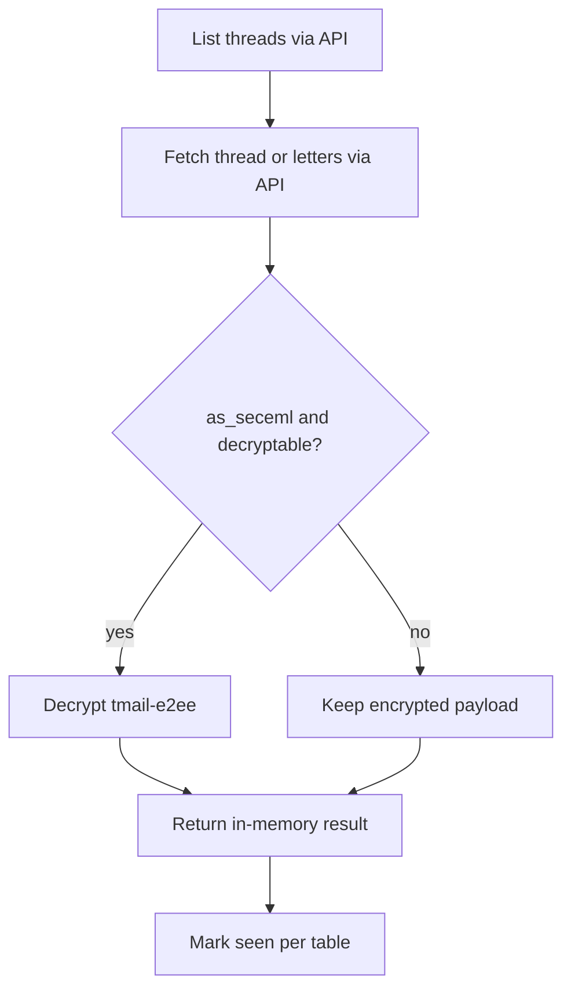

# Read Mail (MCP-first)

**Lazy validation:** call MCP tools directly — errors say what's missing (env, bind, e2ee, wallet_slug). Mail/domain ops need §10 complete. See **tmail-agent-setup**.

**Policy:** `Authorization: Bearer` from active runtime session file in `$TMAIL_PROFILE_DIR/`.  
**E2EE default:** always fetch with `as_seceml:true`, decrypt with keys from `$TMAIL_PROFILE_DIR/e2ee.json`.  
**Storage:** live API + in-memory decrypt only — **no** local mail cache on disk.  
**Mailbox identity:** `meta.json.default_mailbox` is for **new outbound mail only** (no `thread_id`). For replies, resolve `reply_from_address` from thread history — **tmail-send-letter → Reply in thread**. Never reply with `meta.default_mailbox`.

---

## Inputs

- `api_key` from `$TMAIL_PROFILE_DIR/session.json`.
- Target mailbox/folder or `thread_id`/`letter_ids`.

## Prechecks

1. §10 complete for active `wallet_slug` — otherwise tool error with next step. See **tmail-agent-setup → API timing**.
2. Bearer auth available and valid.
3. For encrypted path, `e2ee.json` exists before decrypt attempt.
4. **Reply workflow:** active profile matches the wallet that owns this thread's mailbox identity (same `$TMAIL_PROFILE_DIR` for read and send).

## Protocol

0. **On tool error** — follow actionable message (env / bind / e2ee / wallet_slug). See **tmail-agent-setup → API timing**.
1. List candidates via **`tmail_list_threads`** or folder view via **`tmail_list_folders`** (or direct IDs from caller).
2. Fetch via **`tmail_fetch_thread`** (optional `offset`/`limit` for long threads — default returns all letters) or bulk **`tmail_fetch_letters`** (`mark_read` as needed; API default true when omitted).
3. If encrypted, decrypt using **tmail-e2ee → Protocol steps 1–6**.
4. Return decrypted or encrypted result in memory — **do not** write mail to disk.
5. Mark thread seen via **`tmail_mark_threads_seen`** per table below.

| User intent | Action |
|---|---|
| Summarize inbox / list only | skip **`tmail_mark_threads_seen`** |
| Explicit mark read | **`tmail_mark_threads_seen`** with `seen_flag:true` |
| Webhook-driven incoming | per **tmail-webhooks → Webhook lifecycle** |



## Failure Matrix

| Failure | Action |
|---|---|
| 401/403 on read endpoint | follow **tmail-recovery §ApiKeyRevoked** then retry |
| Fetch API error | Return structured fetch error |
| Decrypt error | Return metadata-only encrypted letter state |
| Seen update error | Keep read result; report seen update separately |
| Reply requested but thread read from wrong wallet profile | **STOP** — **tmail-agent-setup → Multi-wallet profile switch** |

## Done Criteria

1. Thread/letter response returned from live API (optionally decrypted in memory).
2. When decrypt succeeded: result includes `from` and `message_id` in the in-memory payload.
3. No mail files written under `.tmail/`.

---

## Quick reference

| Goal | API |
|------|-----|
| Folder counts | `POST /api/tbox/folders` |
| Inbox list | `POST /api/tbox/threads` |
| Open thread | `POST /api/tbox/threads/letters` — optional `offset`/`limit` for paging (`total`/`has_more` in response) |
| Open letter(s) | `POST /api/tbox/letters/fetch` |
| Mark read | `POST /api/tbox/threads/seen` |
| E2EE body | fetch with `as_seceml: true` + decrypt |

---

## List inbox

```http
POST /api/tbox/threads
Authorization: Bearer <api_key>

{
  "folder": "inbox",
  "offset": 0,
  "limit": 20,
  "unread_only": false,
  "sort_order_timestamp": "desc"
}
```

Use `preview` from thread metadata or `include_last_letter: true` for snippet.

---

## Fetch thread (preferred for conversation)

`tmail_fetch_thread` returns all letters in a thread by default. For long threads (backend caps a thread at 100 letters, delivered in one API round-trip), pass `offset`/`limit` to page through them in bounded chunks instead of receiving the whole thread at once.

**Defaults:** `offset=0`, `limit=0` (0 = return all). When both are omitted, the full thread is returned exactly as before — no behavioral change for existing callers.

**Response adds pagination metadata:**

| Field | Meaning |
|---|---|
| `total` | Total letters in the thread (before slicing) |
| `offset` | Offset applied to this response (echoes request, default 0) |
| `limit` | Limit applied (echoes request; 0 = all) |
| `has_more` | `true` when letters exist beyond the current page |

**Walk a long thread:**

```text
offset=0, limit=20  → has_more=true  → offset=20, limit=20 → ...
offset=0, limit=20  → has_more=false → done
```

`letter_ids[]` is sliced in lockstep with `results[]` (same index window), so consumers that key off `letter_ids` stay in sync with the page.

```http
POST /api/tbox/threads/letters

{
  "thread_id": "<uuid>",
  "as_seceml": true,
  "mark_read": true,
  "offset": 0,
  "limit": 20
}
```

Always fetch from API; decrypt in memory when needed.

---

## Fetch by letter IDs

```http
POST /api/tbox/letters/fetch

{
  "letter_ids": ["<id1>"],
  "as_seceml": true
}
```

---

## Mark read / unread

```http
POST /api/tbox/threads/seen

{
  "thread_ids": ["<uuid>"],
  "seen_flag": true
}
```

---

## E2EE

1. Fetch with `as_seceml:true` (preferred) or `as_seceml:false`.
2. Decrypt: **tmail-e2ee → Protocol steps 1–6**.
3. Use decrypted fields (`from`, `to[]`, `message_id`, `subject`, `body_plain`, `body_html`) in memory only.

Failure handling:
- no `toList[my_pub]` → encrypted but not decryptable for current identity;
- decrypt error → keep metadata and mark body as encrypted.

Repeated reads may call the API again — there is no local cache shortcut.

---

## Webhook-driven read

On `letter.incoming` (**tmail-webhooks → Webhook lifecycle**): use `thread_id` / documented message identifier → fetch from API → decrypt in memory.

---

## Reply handoff (to tmail-send-letter)

1. Same `$TMAIL_PROFILE_DIR` / API key as send.
2. Thread decrypted with `from` + `message_id` available in memory.
3. Send path: **tmail-send-letter → Reply in thread** (`reply_from_address`, `in_reply_to` = parent `message_id`).

Full schemas: **tmail-agent-setup → Local file schemas** and **tmail-sub-agent-api**.
