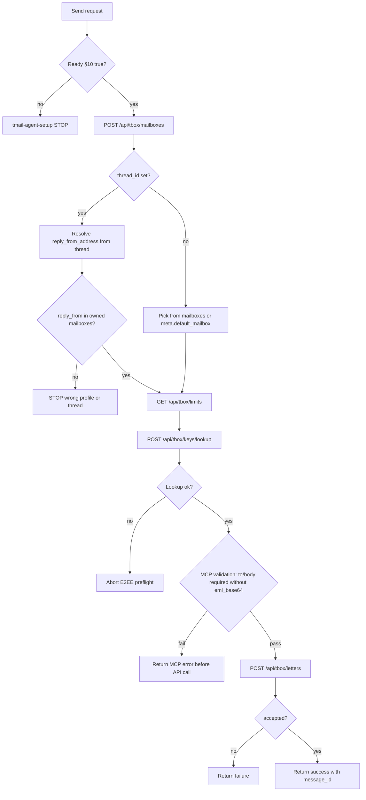

# Send Letter (MCP-first)

**Lazy validation:** call MCP tools directly — errors say what's missing (env, bind, e2ee, wallet_slug). Mail/domain ops need §10 complete. See **tmail-agent-setup**.

**Policy:** Bearer API key from active runtime session file in `$TMAIL_PROFILE_DIR/`. Load `e2ee.json` from `$TMAIL_PROFILE_DIR/` before every send (E2EE default).  
**After send:** return API response to caller; **no** local sent-mail files on disk.

**From address resolution (mandatory — never guess):**

1. **Always** call **`tmail_list_mailboxes`** for the **current** Bearer wallet before send.
2. Copy `web3_address` **exactly** from the tool response — never construct addresses manually.
3. **Free mailbox** (`free_mailbox`, `is_free=true`): use `free_mailbox.web3_address` from API.
4. **Purchased / minted mailbox** (`mailboxes[]`, `is_free=false`): use that row's `web3_address` from API — do not construct the address.
5. **Forbidden:** constructing purchased mailbox addresses manually, using a mailbox not returned for the current wallet, using purchased mailbox from wrong sub-wallet profile.
6. **New mail** (no `thread_id`): if caller omits `from_address`, use `meta.json.default_mailbox` (must originate from mailboxes API).
7. **Reply** (`thread_id` set): **Forbidden** to use `meta.default_mailbox` or omit `from_address` — resolve `reply_from_address` per **Reply in thread** below.
8. NFT on wallet A cannot be sent from wallet B profile — resolve `${TMAIL_MAIN_DIR}/<wallet_slug>/` for the wallet that owns the mailbox.

Paths: **tmail-agent-setup → Path layout**.

## Inputs

- `api_key` from `$TMAIL_PROFILE_DIR/session.json`.
- Structured letter body or `eml_base64`.
- Attachments in base64 (if any).
- E2EE report flag (`report_encryption`, true or false).

## Prechecks

1. §10 complete for active `wallet_slug` — otherwise tool error with next step. See **tmail-agent-setup → API timing**.
2. **`tmail_get_limits`** when sending batch or large payloads.
3. Validate recipients count (`<=10`) and attachments count (`<=10`).
4. Validate total letter bytes (`<=25MB`).
5. Default before send: `e2ee.json` registered, E2EE preflight via **`tmail_send_letter`** with `report_encryption:true`. Abort on lookup failure. No plain-send fallback unless caller explicitly disables E2EE per product policy.
6. **`tmail_list_mailboxes` executed** — `from_address` copied from `web3_address` (never manually built).
7. **Reply precheck:** if `thread_id` set — thread fetched/decrypted and `reply_from_address` resolved before send (see **Reply in thread**).

## Protocol

0. **On tool error** — follow actionable message (env / bind / e2ee / wallet_slug). See **tmail-agent-setup → API timing**.
1. **`tmail_list_mailboxes`** — list mailboxes for **current** Bearer wallet; copy `web3_address` exactly.
2. Resolve `from_address`:
   - **Reply** (`thread_id` set) → **Reply in thread** algorithm (`reply_from_address`); **never** `meta.default_mailbox`;
   - **New mail** → purchased / minted: pick `mailboxes[]` row (`is_free=false`); default/free: `free_mailbox.web3_address`;
   - **New mail only**, if still omitted → `meta.default_mailbox` (saved from mailboxes response at bootstrap).
3. E2EE preflight: local `e2ee.json`, **`tmail_send_letter`** with `report_encryption:true`.
4. Size/quota checks (**`tmail_get_limits`**, 25 MB guard).
5. **`tmail_send_letter`** with resolved `from_address`, `thread_id`, `in_reply_to` when replying. When `eml_base64` is not set, `to`/`to_list` and `body_html`/`body_plain` are required (MCP validates before API call).
6. When `


## Failure Matrix

| Failure | Action |
|---|---|
| Env Gate open (empty `TMAIL_API_URL` in `tmail` MCP env, or no `api_key` and empty `TMAIL_BIND_INVITE`) | Scaffold + user instructions from **tmail-agent-setup**; **STOP and wait** |
| Ready-state §10 incomplete | Run **tmail-agent-setup §7** bootstrap; **STOP** until all §10 checks pass |
| User asked send before first setup | Do not bind/recovery/send; Env Gate + bootstrap first |
| 413 / size exceeded | Abort send and return explicit size error |
| recipients invalid | Abort send with recipient validation error |
| missing recipients without `eml_base64` | MCP returns error before API call: "to or to_list is required when eml_base64 is not provided" |
| missing body without `eml_base64` | MCP returns error before API call: "body_html or body_plain is required when eml_base64 is not provided" |
| invalid `attachments_json` | MCP returns error before API call: "attachments_json must be a JSON array of attachment objects" |
| lookup failed | Abort send and return explicit E2EE preflight failure |
| purchased mailbox not in mailboxes API for current wallet | **STOP** — switch to owning wallet profile; refetch `POST /api/tbox/mailboxes` |
| from_address constructed manually | **STOP** — use `web3_address` from mailboxes ownership response only |
| Reply with `meta.default_mailbox` or empty `from_address` | **STOP** — resolve `reply_from_address` from thread history (**Reply in thread**) |
| Reply from profile that does not own thread mailbox | **STOP** — **tmail-agent-setup → Multi-wallet profile switch** |
| `reply_from_address` not in mailboxes API for active profile | **STOP** — **tmail-agent-setup → Multi-wallet profile switch** |
| Thread has mixed From addresses (bad first send) | Use latest **our** `from` in thread for reply; tell user: «Thread has mixed From addresses; replying as `<reply_from_address>`; first send may have used wrong mailbox.» |
| 429 daily limit exceeded | Return `next_reset_unix` to caller and stop sending |
| accepted missing message_id | Treat as send failure |

## Done Criteria

1. API response has `accepted=true` and non-empty `message_id`.
2. E2EE report captured when requested.
3. No mail files written under `.tmail/`.

---

## Pre-flight

```http
GET /api/tbox/limits
Authorization: Bearer <api_key>
```

Check `daily_limit_send_remaining` before bulk sends.

## Mailbox discovery (mandatory before send)

```http
POST /api/tbox/mailboxes
Authorization: Bearer <api_key>

{ "offset": 0, "limit": 20 }
```

**Response shape (placeholder fields — copy exact strings from live API):**

```json
{
  "free_mailbox": {
    "web3_address": "0#<wallet-hash>@<web3-domain>",
    "web2_address": "0#<wallet-hash>@<web2-domain>",
    "is_free": true
  },
  "mailboxes": [
    {
      "web3_address": "<nft-name>@<web3-domain>",
      "web2_address": "<nft-name>@<web2-domain>",
      "is_free": false
    }
  ],
  "total_count": 1
}
```

**Mailbox selection (send):** canonical rules: **tmail-agent-setup → Mailbox address rules**.

| Mailbox type | Source field | `from_address` |
|---|---|---|
| Free (auto) | `free_mailbox.web3_address` | exact API string |
| Purchased / minted | `mailboxes[].web3_address`, `is_free=false` | exact API string from ownership list |

`<web3-domain>` / `<web2-domain>` in schema examples are placeholders — copy exact strings from live API. Purchased mailboxes: **only** from `mailboxes[]` response, never built manually.

**Forbidden:** any `from_address` not present in the current wallet's mailboxes ownership response.

**New mail only:** if caller omits `from_address`, fallback to `meta.json.default_mailbox` (populated from mailboxes API at bootstrap). **Replies:** see **Reply in thread** — `meta.default_mailbox` is forbidden.

---

## Payload size guard (avoid HTTP 413)

Unified send rule:

- `total letter bytes <= 25 MB` (subject + body_html + body_plain + decoded attachments + metadata)

`attachments[].data_base64` expands request transport size, but server checks decoded attachment bytes.

Preflight rule before `POST /api/tbox/letters`:

1. Estimate `letter_total_bytes = utf8(subject/body/headers) + sum(decoded_attachment_bytes)`.
2. If `letter_total_bytes > 25 MB`, **do not send**. First:
   - compress/resize images (prefer JPEG/WebP for photos),
   - remove duplicated binaries (don't send both inline and attachment unless required),
   - split content into multiple letters.

---

## Structured send

```http
POST /api/tbox/letters
Content-Type: application/json
Authorization: Bearer <api_key>

{
  "from_address": "<from mailboxes[].web3_address>",
  "to": ["<recipient>@<web3-domain>"],
  "subject": "Hello",
  "body_plain": "Text",
  "body_html": "<p>HTML</p>",
  "in_reply_to": "<message-id>",
  "thread_id": "<existing-thread-uuid>",
  "report_encryption": true,
  "attachments": [{
    "filename": "doc.pdf",
    "content_type": "application/pdf",
    "data_base64": "<base64-bytes>"
  }]
}
```

**E2EE is default.** Before sending: check `$TMAIL_PROFILE_DIR/e2ee.json` exists and `registered=true`, run `POST /api/tbox/keys/lookup` for recipient addresses, set `report_encryption:true`. Show user `encryption.fully_e2e` from response. If E2EE preflight fails, abort send and return explicit reason. Details: **tmail-e2ee**.

**MCP-side validation (before API call):** when `eml_base64` is **not** set, MCP rejects early (no network round-trip) if `to`/`to_list` is empty or if both `body_html` and `body_plain` are empty. `eml_base64` bypasses these field-level requirements (the EML is self-contained). `attachments_json`, if provided, must parse as a JSON array.

Encryption behavior (server-side): client sends plaintext JSON/EML to `/api/tbox/letters`; the server encrypts before storage. Details: **tmail-e2ee §10.1**.

Important:
- Do not encrypt letter fields on client before calling `/api/tbox/letters`.
- `in_reply_to` and `thread_id` are plaintext API metadata; encrypted copy is handled server-side.

**Response:**

```json
{
  "message_id": "<message-id>@<web3-domain>",
  "accepted": true,
  "encryption": { "fully_e2e": true, ... }
}
```

**Cache file** (when `
```json
{
  "sent_at": 1719054000,
  "request": { ... },
  "response": { "message_id", "accepted", "encryption" }
}
```

---

## EML mode

```json
{
  "eml_base64": "<base64-rfc5322>",
  "from_address": "<from free_mailbox.web3_address or mailboxes[].web3_address>"
}
```

Use `free_mailbox.web3_address` or NFT `mailboxes[].web3_address` from API — never guess.

Overrides structured fields.

## Limits

| Rule | Value |
|------|-------|
| Recipients | max 10 |
| Attachments | max 10 |
| Total size | 25 MB |
| Daily sends | shared owner+subs (see limits) |

Delivery is **async** — use webhooks for incoming replies.

---

## Reply in thread

**API fact:** `POST /api/tbox/letters` does **not** restore `From` from `thread_id`. If `from_address` is omitted, server uses the wallet **free** mailbox — not the thread's prior sender. Agent must set `from_address` explicitly on every reply.

**One thread = one sub-account:** read and reply through the **same** `$TMAIL_PROFILE_DIR` / API key (pass `wallet_slug` when multi-wallet).

### Reply metadata (mandatory when `thread_id` set)

| API field | Source | Rule |
|---|---|---|
| `thread_id` | caller / thread context | same thread being answered |
| `in_reply_to` | parent letter `message_id` | RFC Message-ID from decrypted API response (e.g. `<id>@<web3-domain>`); **not** `letter_id` |
| `from_address` | `reply_from_address` algorithm below | must ∈ mailboxes API for active profile |

### Resolve `reply_from_address` (mandatory when `thread_id` set)

Prerequisite: thread letters loaded via **tmail-read-mail** (live API fetch + in-memory decrypt).

Build **owned set** from `POST /api/tbox/mailboxes`: all `web3_address` in `free_mailbox` + `mailboxes[]`.

| Priority | Source | Rule |
|---|---|---|
| 1 | Decrypted thread letters (our outbound) | `from` on letters where `from` ∈ owned set; pick **most recent** |
| 2 | Decrypted thread letters (incoming-only thread) | earliest letter: pick entry from `to[]` that ∈ owned set |

If `from` / `to[]` / `message_id` missing after fetch → refetch thread via **tmail-read-mail**; **never** fallback to `meta.default_mailbox`. If decrypt fails and `from` / `message_id` cannot be recovered → **STOP** (encrypted-not-replyable); do not guess reply metadata.

After resolution:

1. `reply_from_address` must ∈ owned set — else **STOP** (**tmail-agent-setup → Multi-wallet profile switch**).
2. Send with `from_address: reply_from_address`, same `thread_id`, `in_reply_to: <parent Message-ID>` from letter being answered.

**Forbidden on reply:** `meta.default_mailbox`, empty `from_address`, mailbox from another sub-account's profile.

**Mixed From in one thread** (e.g. first send used wrong purchased address): still reply with resolved `reply_from_address` from **our** participation in the thread; report the inconsistency — do not silently switch to `meta.default_mailbox`.

Full read path: **tmail-read-mail → Reply handoff**.
