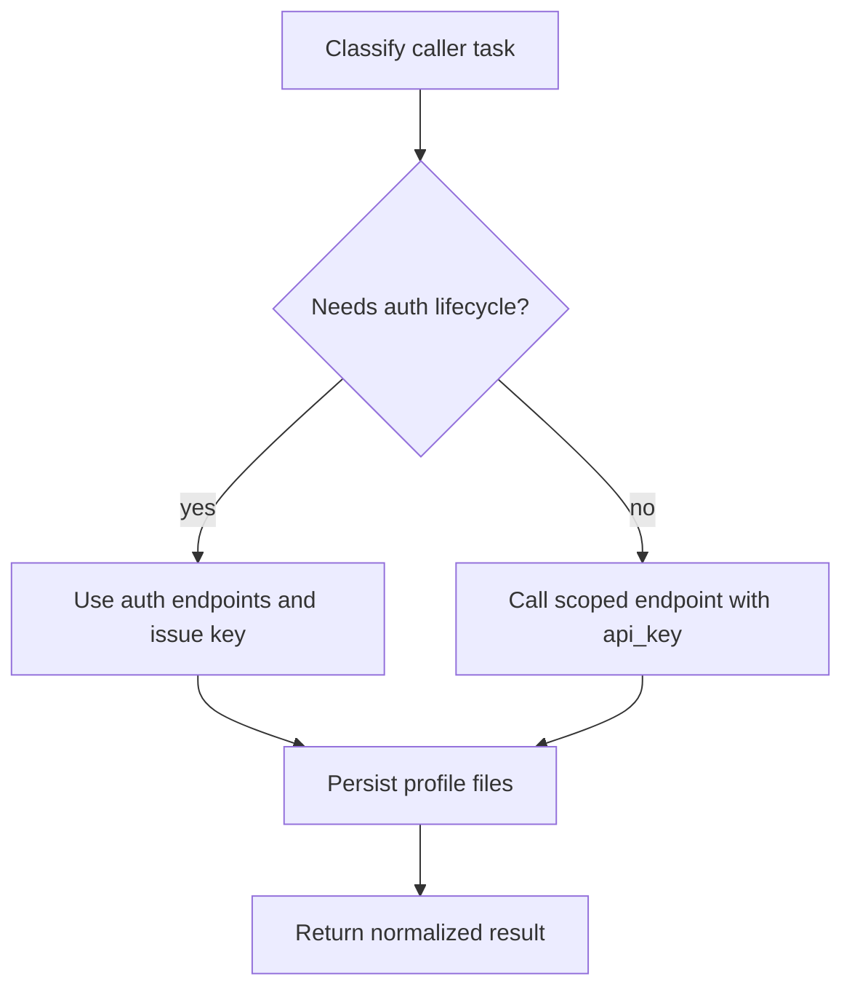

# TMail Sub-Agent — MCP tools + REST fallback

**STOP gate (step 0):** **tmail-agent-setup → Env Gate + §10** + MCP **`tmail_gate_check`**. Catalog MCP tools run only when gate is `READY`; auth lifecycle follows **tmail-agent-setup → API timing**.

**MCP-first:** agents call **`tmail_*` tools** via `npx @tmail/mcp`. This skill maps tools to REST endpoints for **fallback only** when MCP server is offline.

| MCP tool | REST fallback (offline only) |
|----------|------------------------------|
| `tmail_gate_check` | `npx @tmail/mcp gate` (CLI fallback) |
| `tmail_auth_status` | `GET /api/tbox/limits` |
| `tmail_list_mailboxes` | `POST /api/tbox/mailboxes` |
| `tmail_get_limits` | `GET /api/tbox/limits` |
| `tmail_list_threads` | `POST /api/tbox/threads` |
| `tmail_fetch_thread` | `POST /api/tbox/threads/letters` |
| `tmail_send_letter` | `POST /api/tbox/letters` |
| `tmail_generate_payload` | `POST /api/auth/generate-payload` |
| `tmail_sub_bind` | `POST /api/subacc/auth/bind` |
| `tmail_sub_login` | `POST /api/subacc/auth/login` |
| `tmail_webhook_set` | `PUT /api/tbox/webhook` |
| `tmail_webhook_get` | `GET /api/tbox/webhook` |
| `tmail_webhook_delete` | `DELETE /api/tbox/webhook` |
| `tmail_webhook_rotate_secret` | `POST /api/tbox/webhook/rotate-secret` |
| `tmail_e2ee_generate_local` | `PUT /api/tbox/keys` (preferred; client-side keygen) |
| `tmail_e2ee_register` | `PUT /api/tbox/keys` (`pub_key_e2e`) |
| `tmail_e2ee_get` | `GET /api/tbox/keys` |
| `tmail_e2ee_lookup` | `POST /api/tbox/keys/lookup` |
| `tmail_nft_quote_mint` | `POST /api/nft/provide-mint` (quote only, no txs) |
| `tmail_nft_prepare_mint` | `POST /api/nft/provide-mint` (after user confirms `total_nano`) |
| `tmail_fetch_letters` | `POST /api/tbox/letters/fetch` |
| `tmail_list_folders` | `POST /api/tbox/folders` |
| `tmail_mark_threads_seen` | `POST /api/tbox/threads/seen` |

**Catalog:** MCP resource `tmail://tools/catalog` (scope, gate, REST mapping). Registry: `subagent-coverage.json` in the package root.

**Deferred (no MCP tool):** `POST /api/auth/refresh` — use `tmail_sub_login` instead.

**Primary credential:** `Authorization: Bearer <api_key>` — permanent signed API key (set inside MCP client from `session.json`).
**JWT used only for:** bind/login lifecycle. Owner key management is human-only. See **tmail-sub-agent-auth**.

**Local state:** derive `$TMAIL_PROFILE_DIR` via `tmail_profile_dir(TMAIL_MAIN_DIR, sub_address)`. Mail operations are live API + in-memory only.

**Machine-readable:** `GET /api/guide/tutorial`, `GET /api/guide/scopes`, OpenAPI `/openapi.json`.

---

## Inputs

- Bearer `api_key` (or JWT only for auth lifecycle endpoints).
- Endpoint-specific JSON payloads from schemas below.
- Local profile paths for auth/e2ee/webhook side effects only (no mail cache).

## Prechecks

1. **Auth lifecycle endpoints** (`/api/auth/*`, `/api/subacc/auth/*`, `/api/tbox/keys/*` during bootstrap): use **MCP tools** on **WAIT_ENV_BIND**, **SETUP_BIND**, **SETUP_FINISH**, **AUTH_NEEDS_LOGIN** per **tmail-agent-setup → API timing** (REST fallback only when MCP offline).
2. **Catalog/domain ops** (mailboxes, letters, threads, webhook): **`tmail_gate_check` → READY** for active `wallet_slug`. Else → **STOP** per **API timing**.
3. Correct scope for target endpoint.
4. Payload limits respected (`<=10` recipients, `<=10` attachments, `<=25MB` total letter size).
5. Required local files loaded (`session.json`; `e2ee.json` for encrypted read/send flows).

## Protocol

0. **tmail_gate_check + Env Gate + Ready §10** — call **`tmail_gate_check`**; if `status` ≠ `READY` → **STOP** (see **tmail-agent-setup → API timing**).
1. Select **MCP tool** from table above by task type (auth/send/read/webhook).
2. Execute tool with strict parameters (MCP enforces API schemas).
3. Persist profile side effects per owning skill (session, meta, e2ee, webhook — never mail bodies).
4. Return normalized tool result to caller. **REST fallback** only if MCP call fails with transport/offline error.



## Failure Matrix

| Failure | Action |
|---|---|
| 401 auth issue | follow **tmail-recovery §ApiKeyRevoked** / **§OwnerRotate** / **§OwnerRevoke** |
| 403 scope issue | use key with required scope or owner-managed endpoint |
| 413 size violation | reject locally before retry |
| 422 schema mismatch | correct payload shape per endpoint table |
| 429 quota/rate | return `next_reset_unix` when present and backoff |
| 409 max API keys | stop and ask human owner to clean key slots; then repeat login/bind |

## Done Criteria

1. Endpoint result matches documented response contract.
2. Profile side effects persisted per owning skill when applicable (no mail cache on disk).
3. Caller has deterministic next step (success path or explicit failure path).

---

## Authentication

| Method | Header | TTL | When |
|--------|--------|-----|------|
| **API Key** (primary) | `Authorization: Bearer tmail_s_<rand>.<sig>` | Permanent | ALL daily requests |
| Session JWT | `Authorization: Bearer <jwt>` | 15 min | Bind, login, key issuance |

### API Key Endpoints

```
POST /api/acc/keys/sub        — Human-managed only (not sub-agent autonomous flow)
GET  /api/acc/keys             — List your keys
DELETE /api/acc/keys/{id}      — Revoke a key (human-managed)
```

Owner-only (JWT gate):
```
POST /api/acc/keys/owner        — Issue owner bundle → {api_key (tmail_o_*), bind_invite (tmail_i_*)}
POST /api/acc/keys/owner/rotate — Kill-switch: cascade revoke all + issue new bundle
DELETE /api/acc/keys/owner      — Revoke owner key + invite + sub-keys (no replacement)
```

Sub-agent must never use owner `api_key` (`tmail_o_*`) and must never execute owner key endpoints.

## Sub-agent JWT scopes

| Scope | Endpoints |
|-------|-----------|
| `mailbox:read` | mailboxes, NFT mint prep |
| `mail:send` | send, limits, keys/lookup |
| `mail:read` | threads, folders, fetch, seen |
| `e2ee:manage` | keys GET/PUT/generate |
| `webhook:manage` | webhook CRUD |

Owner also has `subaccounts:manage` (list/revoke subs).

Free tier (`GET /api/guide/tutorial` → `free_tier_limits`): 500 sends/day (owner+subs), 10 recipients, 10 attachments, 25 MB/letter, 500 MB storage.

---

## Auth (no Bearer until bound)

| Method | Path | Auth | Body / response |
|--------|------|------|-----------------|
| POST | `/api/auth/generate-payload` | none | → `{ "payload": "<hex>" }` |
| POST | `/api/subacc/auth/bind` | none | `{ "bind_invite", "sub_proof": { "address", "proof": { "timestamp", "domain": { "lengthBytes", "value" }, "payload", "signature", "state_init" } }, "name?" }` → `{ "api_key", "key_prefix", "sub_address", "access_token", "refresh_token", "key_issue_error?" }` |
| POST | `/api/subacc/auth/login` | none | `{ "address", "proof": {…}, "name?" }` → `{ "api_key", "key_prefix", "sub_address", "access_token", "refresh_token", "key_issue_error?" }` |
| POST | `/api/auth/refresh` | none | `{ "refresh_token" }` → tokens; sub may include inline `api_key` |

TonProof: sign via `@ton/mcp` `generate_ton_proof`. **MCP:** pass flat proof to `tmail_sub_bind`/`tmail_sub_login` (MCP maps internally). **REST fallback only:** map flat → nested API (**tmail-sub-agent-auth** Step 3).  
Persist `api_key` from bind/login/refresh responses. Daily operations use permanent `api_key`; JWT/refresh for recovery only.

---

## Health & guides (public)

| Method | Path | Response |
|--------|------|----------|
| GET | `/api/health` | service health |
| GET | `/api/guide/tutorial` | onboarding, proof_schema, lifecycle |
| GET | `/api/guide/scopes` | scope catalog |
| GET | `/api/guide/skills` | skills install metadata (package-only via npx skills add) |

---

## Mailboxes & limits

### POST `/api/tbox/mailboxes` — `mailbox:read`

```json
{ "offset": 0, "limit": 20 }
```

→ `{ "free_mailbox": { "web3_address", "web2_address", "is_free": true }, "mailboxes": [{ "web3_address", "web2_address", "is_free": false }], "total_count" }`

**`from_address` rules (mandatory before send):** see **tmail-agent-setup → Mailbox address rules** — always `POST /api/tbox/mailboxes` first; copy `web3_address` exactly; never construct manually.

Example response (placeholders — copy exact API strings):

```json
{
  "free_mailbox": {
    "web3_address": "0#<wallet-hash>@<web3-domain>",
    "web2_address": "0#<wallet-hash>@<web2-domain>",
    "is_free": true
  },
  "mailboxes": [
    {
      "web3_address": "<nft-name>@<web3-domain>",
      "web2_address": "<nft-name>@<web2-domain>",
      "is_free": false
    }
  ]
}
```

### GET `/api/tbox/limits` — `mail:send`

→ `{ "daily_limit_send_total", "daily_limit_send_used", "daily_limit_send_remaining", "next_reset_unix", "mailbox_storage_*", "is_subaccount", "owner_wallet" }`

---

## Send mail

### POST `/api/tbox/letters` — `mail:send`

**Structured (`from_address` from mailboxes API `web3_address`):**

**Reply:** when `thread_id` is set, `from_address` = `reply_from_address` from **tmail-send-letter → Reply in thread** — API does not infer From from the thread.

```json
{
  "from_address": "<from mailboxes[].web3_address>",
  "to": ["<recipient>@<web3-domain>"],
  "subject": "Hello",
  "body_plain": "Text",
  "body_html": "<p>HTML</p>",
  "in_reply_to": "<message-id>",
  "thread_id": "uuid",
  "report_encryption": true,
  "attachments": [{
    "filename": "doc.pdf",
    "content_type": "application/pdf",
    "data_base64": "<bytes>"
  }]
}
```

**EML mode:** `{ "eml_base64": "...", "from_address?": "<from mailboxes API>" }` — overrides other fields.

→ `{ "message_id", "accepted", "encryption?": { "sender_e2e", "fully_e2e", "e2e_recipients", … } }`

**After success:** when `
Rules: max 10 recipients, 10 attachments, 25 MB total. Async delivery.

---

## Receive mail

### POST `/api/tbox/folders` — `mail:read`

```json
{ "mailbox": "" }
```

→ `{ "folders": [{ "name", "count", "unread" }] }`

### POST `/api/tbox/threads` — `mail:read`

```json
{
  "mailbox": "",
  "folder": "inbox",
  "offset": 0,
  "limit": 20,
  "unread_only": false,
  "include_last_letter": false,
  "as_seceml": false,
  "sort_order_timestamp": "desc"
}
```

→ `{ "threads": [{ "thread_id", "folder", "unread", "letter_ids", "last_letter_id", "count", "unix_time", "labels", "last_letter?", "last_letter_seceml?" }], "total_count" }`

Folder: `inbox`, `sent`, `spam`, or empty (all except UNSEEN-only logic). Max limit 50.

### POST `/api/tbox/threads/letters` — `mail:read` (fetch whole thread)

```json
{
  "mailbox": "",
  "thread_id": "<uuid>",
  "is_draft": false,
  "as_seceml": true,
  "mark_read": true
}
```

→ `{ "thread_id", "is_draft", "letter_ids", "results": [{ "letter_id", "seceml_base64?", "encrypted_data?", "error?" }], "failed_letter_ids?" }`

**Cache (when `
### POST `/api/tbox/letters/fetch` — `mail:read` (fetch by IDs)

```json
{
  "mailbox": "",
  "letter_ids": ["id1", "id2"],
  "is_draft": false,
  "as_seceml": true
}
```

→ `{ "results": [{ "letter_id", "seceml_base64?", "encrypted_data?", "error?" }] }`

Always fetch from API; decrypt in memory per **tmail-read-mail** / **tmail-e2ee**.

### POST `/api/tbox/threads/seen` — `mail:read`

```json
{
  "mailbox": "",
  "thread_ids": ["<uuid>"],
  "seen_flag": true
}
```

→ `{ "threads_stats_map?" }` — `true` = mark read, `false` = unread.

---

## E2EE keys

| Method | Path | Scope | Body |
|--------|------|-------|------|
| GET | `/api/tbox/keys` | `e2ee:manage` | — → `{ "pub_key_e2e" }` |
| PUT | `/api/tbox/keys` | `e2ee:manage` | `{ "pub_key_e2e": "<base64-32b>" }` |
| POST | `/api/tbox/keys/generate` | `e2ee:manage` | `{ "passphrase": "min16chars", "acknowledge_server_side_risk": true, "register": true }` → pub + enc_priv + salt; MCP writes `$TMAIL_PROFILE_DIR/e2ee.json` |
| POST | `/api/tbox/keys/lookup` | `mail:send` | `{ "addresses": ["<recipient>@<web3-domain>"] }` max 20 |

Decrypt fetched seceml client-side — **tmail-e2ee** (in-memory only; no disk cache).

### E2EE wire details (read responses)

- `as_seceml: true` → response has `seceml_base64` (SecEML binary; kind `0x01` body = JSON `EncryptedData`)
- `as_seceml: false` → response has `encrypted_data` JSON directly
- Unwrap/decrypt protocol: **tmail-e2ee** (not duplicated here)

---

## Webhooks

| Method | Path | Scope | Body |
|--------|------|-------|------|
| GET | `/api/tbox/webhook` | `webhook:manage` | → `{ "configured", "url" }` (no secret) |
| PUT | `/api/tbox/webhook` | `webhook:manage` | `{ "url", "secret" }` min **16** chars — save to profile |
| DELETE | `/api/tbox/webhook` | `webhook:manage` | — |
| POST | `/api/tbox/webhook/rotate-secret` | `webhook:manage` | `{ "new_secret" }` |

Delivery: `POST` your URL, header `X-TMailbox-Signature` = `sha256=` + HMAC-SHA256(SHA256(raw_secret), raw_body). Event `letter.incoming` data fields: `message_id`, `thread_id`, `from`, `subject`. Full lifecycle: **tmail-webhooks → Webhook lifecycle**.

---

## NFT domain mint

### POST `/api/nft/provide-mint` — `mailbox:read`

```json
{ "name": "alice", "ref_addrs": "UQ..." }
```

→ `{ "name", "taken", "price_nano", "price_full", "gas_nano", "referral_nano", "total_nano", "transactions[]" }`

Show `total_nano` before `@ton/mcp` `send_raw_transaction`. Details: **tmail-nft-domain**.

---

## Owner-only (`subaccounts:manage`)

| Method | Path | Body |
|--------|------|------|
| POST | `/api/subaccounts` | `{ "offset", "limit" }` → subaccounts list |
| GET | `/api/subaccounts/{address}` | one subaccount |
| DELETE | `/api/subaccounts/{address}` | revoke sub (cascade: API keys + refresh tokens + webhook) |
| POST | `/api/subaccounts/{address}/purge` | `{ "acknowledge_irreversible_data_loss": true }` — hard delete (revoked only) |
| GET | `/api/subaccounts/quota` | quota summary |

Bind invite (`tmail_i_*`) is issued once with the owner key bundle
(`POST /api/acc/keys/owner`). It is reusable, has no TTL, and dies only on
owner key rotate/revoke. Share it OOB with sub-agents for `/api/subacc/auth/bind`.

Owner key kill-switch (not for sub-agents): `POST /api/acc/keys/owner/rotate`
(rotate) or `DELETE /api/acc/keys/owner` (revoke). Both invalidate the bind invite.

---

## Related skills

| Skill | When to open |
|-------|--------------|
| **tmail-agent-setup** | Env Gate, path layout, Ready §10, live API policy
| **tmail-owner-setup** | Owner key bundle and bind invite issuance |
| **tmail-sub-agent-auth** | TonProof mapping, bind vs login, runtime session files |
| **tmail-recovery** | Rotate/revoke and key loss recovery |
| **tmail-send-letter** | Send workflow, reply in thread, from_address selection |
| **tmail-read-mail** | Inbox/thread fetch, live API only
| **tmail-e2ee** | Key registration and decrypt protocol |
| **tmail-webhooks** | Register, HMAC verify, post-delivery fetch/decrypt |
| **tmail-nft-domain** | NFT mailbox mint flow |
