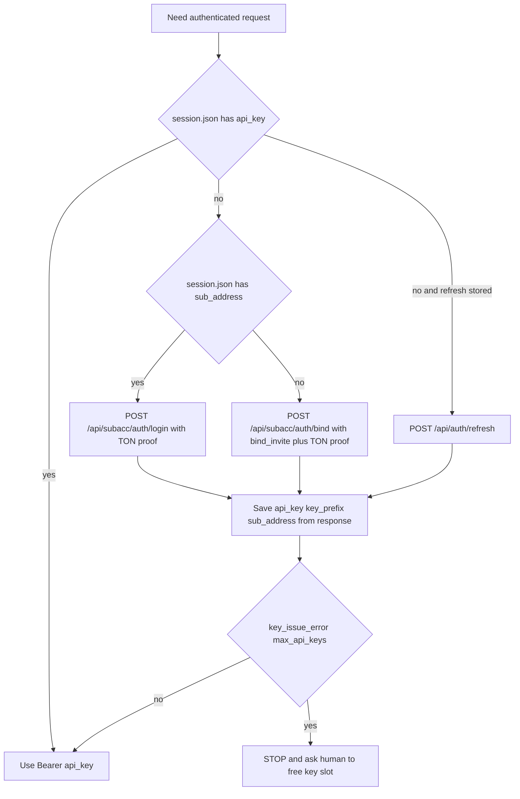

# TMail Sub-Agent Auth (REST)

**Policy:** HTTP API only. Bind/login return a **permanent signed API key** inline. Use `Authorization: Bearer <api_key>` for ALL daily requests. No JWT refresh cycles on happy path.

**Env gate:** call **`tmail_gate_check`** then **tmail-agent-setup → Env Gate** first. If `WAIT_ENV_BIND` — fill bind_invite and wait "ready". If `SETUP_BIND` — MCP bind flow. If `SETUP_FINISH` — MCP e2ee. If `AUTH_NEEDS_LOGIN` — `tmail_sub_login` (no bind_invite). If `STOP` (hard error) or `INVALID_SESSION` — follow instructions and stop.
**Auth rule:** sub-agent can use its own TonProof with `bind_invite` on `/api/subacc/auth/bind` (first bind). Sub-agent can use its own TonProof without invite on `/api/subacc/auth/login` (already bound). Owner wallet proof is forbidden.

**Credentials:**
- `Authorization: Bearer <api_key>` — permanent signed key (daily operations)
- Session JWT — recovery-only (max-keys cleanup; not stored on happy path)
- Bind invite used only on first bind or owner rotate recovery

Setup: **tmail-agent-setup** (Path layout: `.tmail/<wallet_slug>/` from `sub_address`).

---

## Inputs

- `TMAIL_API_URL`.
- TON proof data from `@ton/mcp generate_ton_proof`.
- For first bind: `TMAIL_BIND_INVITE` (reusable `tmail_i_*` from owner key bundle).
- TonProof is always created by the sub-agent wallet itself (never by owner wallet).
- Session storage: active runtime file in `$TMAIL_PROFILE_DIR/` (`session.<runtime_id>.json` or `session.json`).

## Prechecks

1. **Env Gate passed** (tmail-agent-setup) — `TMAIL_API_URL` set; `TMAIL_BIND_INVITE` is required only for bind path.
2. `POST /api/auth/generate-payload` performed for current auth attempt.
3. Proof payload/domain are identical to values used in signature.
4. Session file can be written atomically.
5. Runtime file selection rule is applied before read/write:
   - `runtime_id = sanitize(lowercase basename of process argv0)` with fallback `default`
   - use `session.<runtime_id>.json` if present with non-empty `api_key`, else use `session.json`
6. Owner key must not appear in sub-agent context (`tmail_o_*`, `OWNER_API_KEY`, `TMAIL_OWNER_API_KEY`).

## Protocol

Credential policy:

| Path | When | Credential |
|---|---|---|
| Daily mail/tbox operations | default path | Bearer `api_key` only |
| Recovery | key lost/revoked, owner rotate/revoke | login (preferred) or refresh → save inline `api_key` |

Protocol steps:

1. Decide path (api_key / login / bind / refresh shortcut) using decision flow below.
2. Execute auth endpoint for selected path.
3. Persist `api_key`, `api_key_prefix`, `sub_address` from response (inline from bind/login/refresh).
4. Use only `Authorization: Bearer <api_key>` for regular operations.
5. Persist only inline `api_key` returned by `/bind` or `/login`. Do not issue extra keys from sub-agent flow.

## Failure Matrix

| Failure | Action |
|---|---|
| Env Gate open (empty MCP env or required vars) | scaffold + user instructions from tmail-agent-setup; **STOP and wait** |
| 401 signature verification failed | regenerate payload and re-sign proof |
| 401 api key revoked | follow **tmail-recovery §ApiKeyRevoked** |
| 401 sub-account has been revoked | Owner revoked sub — use **bind** (not login) with valid bind_invite; follow **tmail-recovery §SubRevoked** |
| owner rotated keys/invite invalid | follow **tmail-recovery §OwnerRotate** |
| `key_issue_error: max_api_keys_reached` | **STOP** and ask human owner to clean key slots (Dashboard/API); no agent-side revoke/rotate |
| owner key appears in sub-agent context (`tmail_o_*`) | **STOP** — remove owner key from sub env/session; use bind/login with TonProof only |
| session write failure | do not continue with partial auth state |

## Done Criteria

1. Active runtime session file has non-empty `api_key` and `sub_address`.
2. Authenticated call with Bearer API key succeeds.
3. No secrets leaked to logs.

---

## Environment

Load vars per **tmail-agent-setup → Env Gate**; derive paths per **Path layout** (`tmail_profile_dir(TMAIL_MAIN_DIR, sub_address)`).

After bind/login: MCP creates `${TMAIL_MAIN_DIR}/<wallet_slug>/profile` — do **not** add per-wallet lines to MCP env.

`TMAIL_API_KEY` lives in `$TMAIL_PROFILE_DIR/session.json` after bind/login — not in MCP env.

**Domain/mail ops** (send, read, webhook, NFT): only when **`tmail_gate_check` → `status: READY`** for active wallet.

Never hardcode profile paths. Resolve auth state via `$TMAIL_PROFILE_DIR/session.json`.

---

## Multi-agent key policy

- `1 TON wallet = 1 folder` (`.tmail/<wallet_slug>/profile` where slug = hex from `sub_address`)
- `1 runtime = 1 API key` (Cursor/OpenHands/cron each gets its own session file)
- Per-sub limit: max 3 active API keys (`key_issue_error: max_api_keys_reached`)
- Key name convention: `<agent_name>-<runtime>-key` (pass in bind/login `name`)
- `e2ee.json` is wallet-scoped and must never be reused across different wallets

`<agent_name>` comes from bind body `name`; setup bootstrap writes it into `meta.agent_name`.

---

## API Key Lifecycle (PRIMARY)

```
load active runtime session file from $TMAIL_PROFILE_DIR
├─ api_key present? → use Authorization: Bearer <api_key> for ALL requests
├─ bound before? → POST /api/subacc/auth/login + proof → save api_key from response
└─ first run → POST /api/subacc/auth/bind + bind_invite + proof → save api_key from response
```

When `refresh_token` is stored: `POST /api/auth/refresh` → save inline `api_key`.

`POST /api/acc/keys/sub` — not part of sub-agent autonomous flow (human-managed only).

---

## Auth decision flow (strict)



---

## Step 1 — Payload

```http
POST /api/auth/generate-payload
```

→ `{ "payload": "<hex>" }` — use same hex in proof.

---

## Step 2 — Sign ( @ton/mcp )

Tool: `generate_ton_proof` with `{ "domain": "<API hostname>", "payload": "<hex>" }`

Returns flat: `address`, `domainValue`, `domainLengthBytes`, `timestamp`, `signature`, `walletStateInit`, `payload`.

---

## Step 2b — MCP bind/login (primary — use in Cursor)

When calling **`tmail_sub_bind`** or **`tmail_sub_login`**:

- Pass **`ton_proof_json`** = `JSON.stringify(flat)` where `flat` is the **`proof` object** from `@ton/mcp generate_ton_proof` (top-level keys: `address`, `domainValue`, `domainLengthBytes`, `timestamp`, `signature`, `walletStateInit`, `payload`).
- **MCP also accepts** nested REST `{ address, proof: { domain, state_init, ... } }` and auto-converts — but flat is preferred.
- Also pass **`payload`** = same hex from **`tmail_generate_payload`**.
- **Do NOT** manually re-map if already flat — `@ton/mcp` runs `mapFlatToAPI()` internally.

Example MCP args:

```json
{
  "ton_proof_json": "{\"address\":\"0:...\",\"domainValue\":\"your-api.example.com\",\"domainLengthBytes\":20,\"timestamp\":1719054000,\"signature\":\"...\",\"walletStateInit\":\"...\",\"payload\":\"...\"}",
  "payload": "<hex from tmail_generate_payload>",
  "name": "my-agent"
}
```

401 `proof has expired` or `sub proof verification failed` with MCP usually means nested REST JSON was passed, timestamp is zero, or proof is older than ~15 min — regenerate payload and re-sign immediately.

---

## Step 3 — Map to API nested proof (REST fallback ONLY — when MCP offline)

> **Not for MCP:** skip this step when using `tmail_sub_bind` / `tmail_sub_login`.

```python
def map_mcp_proof(mcp_out: dict, payload: str) -> dict:
    return {
        "address": mcp_out["address"],
        "proof": {
            "timestamp": mcp_out["timestamp"],
            "domain": {
                "lengthBytes": mcp_out["domainLengthBytes"],
                "value": mcp_out["domainValue"],
            },
            "payload": payload,
            "signature": mcp_out["signature"],
            "state_init": mcp_out["walletStateInit"],
        },
    }
```

Drop `chain`, `publicKey` from MCP output. **Do not** change `domain.value` — it is signed.

---

## Step 4a — First bind

```http
POST /api/subacc/auth/bind
Content-Type: application/json

{
  "bind_invite": "<TMAIL_BIND_INVITE>",
  "sub_proof": { "address": "...", "proof": { ... } },
  "name": "my-agent"
}
```

→ `{ "api_key", "key_prefix", "sub_address", "access_token", "refresh_token", "key_issue_error?" }`

Save `api_key` immediately. Do not store JWT/refresh on happy path.

---

## Step 4b — Re-login (preferred recovery)

```http
POST /api/subacc/auth/login
Content-Type: application/json

{
  "address": "<sub_address>",
  "proof": { ... },
  "name": "my-agent-cursor-key"
}
```

→ `{ "api_key", "key_prefix", "sub_address", "access_token", "refresh_token", "key_issue_error?" }`

---

## Human-only key management

- Sub-agent never uses owner key (`tmail_o_*`) and never asks user to place it into sub env.
- Sub-agent never executes owner rotate/revoke or arbitrary key deletion to resolve auth issues.
- If key slots are full (`max_api_keys_reached`) — stop and hand off cleanup to human owner.

---

## Using API Key on mail API

```http
Authorization: Bearer tmail_s_<rand>.<sig>
POST /api/tbox/letters
```

---

## Refresh shortcut (optional)

**Blocked when:** Env Gate was open in this session; `meta.json` does not exist (no prior successful bind); **`tmail_gate_check`** returns `WAIT_ENV_BIND` or `INVALID_SESSION`.

Refresh/login only when `$TMAIL_PROFILE_DIR/meta.json` already existed with `sub_address` from a prior bind, or explicit recovery branch in **tmail-recovery**.

```http
POST /api/auth/refresh
{ "refresh_token": "<from session.json if stored>" }
```

→ may include inline `api_key`. Prefer TonProof login when wallet is available.

---

## Session write protocol (must persist atomically)

After bind/login, rewrite active runtime session file in one transaction:

1. write temp file `<session_file>.tmp`
2. fsync temp file
3. atomic rename to `<session_file>`

Minimum fields on happy path:

```json
{
  "bound": true,
  "sub_address": "0:...",
  "api_key": "tmail_s_...",
  "api_key_prefix": "..."
}
```

Recovery-only (not required on happy path): `access_token`, `refresh_token`.

---

## Errors

| HTTP | Cause | Fix |
|------|-------|-----|
| 401 sub/proof verification failed (MCP bind/login) | Wrong domain/payload, bad signature, or stale proof | Regenerate payload + flat proof; bind within 15 min |
| 401 proof has expired | Stale proof (>15 min) | `tmail_generate_payload` → `generate_ton_proof` → bind immediately |
| 401 signature verification failed | domain/payload mismatch | Echo MCP domain; same payload from step 1 |
| 401 api key invalid or revoked | Key revoked or owner rotated | Follow **tmail-recovery §ApiKeyRevoked** or **§OwnerRotate** |
| 401 owner anchor key is revoked | Owner kill-switch activated | Follow **tmail-recovery §OwnerRevoke** |
| key_issue_error max_api_keys_reached | 3 keys per sub limit | Follow **tmail-recovery §MaxApiKeys** |
| 422 unexpected property chain (REST curl) | Flat MCP sent directly to REST body | Use `map_mcp_proof` for curl only |

Full endpoint list: **tmail-sub-agent-api**. Machine-readable: `GET /api/guide/tutorial`.
