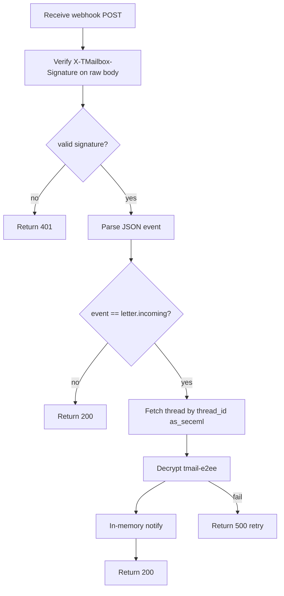

# TMail Webhooks (REST)

**Lazy validation:** call MCP tools directly — errors say what's missing (env, bind, e2ee, wallet_slug). Mail/domain ops need §10 complete. See **tmail-agent-setup**.

Scope: **`webhook:manage`**. Secret persisted in **`$TMAIL_PROFILE_DIR/webhook.json`** (under `.tmail/<wallet_slug>/`; **tmail-agent-setup**).

---

## Inputs

- `api_key` with `webhook:manage`.
- Webhook URL and secret for register/set (min length **16**; rotate `new_secret` min **8**).
- Incoming webhook raw body and `X-TMailbox-Signature`.

## Prechecks

1. §10 complete for active `wallet_slug` — otherwise tool error with next step. See **tmail-agent-setup → API timing**.
2. Registration URL is HTTPS in production.
3. Secret exists in `$TMAIL_PROFILE_DIR/webhook.json`.
4. Incoming handler reads raw bytes before JSON parsing.

## Protocol

0. **On tool error** — follow actionable message (env / bind / e2ee / wallet_slug). See **tmail-agent-setup → API timing**.
1. Register/update via **`tmail_webhook_set`**; read **`tmail_webhook_get`**; delete **`tmail_webhook_delete`**; rotate **`tmail_webhook_rotate_secret`** (see **Webhook lifecycle**).
2. On incoming event, verify signature first (**§3**).
3. Parse event payload only after signature success.
4. Route wallet/profile (**§5**), then fetch/decrypt per **§6**.
5. Return HTTP status per **§7** — do not ACK before fetch/decrypt processing completes in memory.

## Failure Matrix

| Failure | Action |
|---|---|
| missing signature header | HTTP 400 |
| signature mismatch | HTTP 401 |
| malformed JSON after valid signature | HTTP 400 |
| fetch/decrypt failure after valid signature | HTTP 500 — server retries webhook delivery on non-2xx; receiver must not ACK before processing completes |

## Done Criteria

1. Signature validation enforced on every incoming request.
2. `letter.incoming` events processed: fetch + decrypt in memory.
3. No webhook secret written to logs.

---

## Webhook lifecycle

### 1. Register

```http
PUT /api/tbox/webhook
Authorization: Bearer <api_key>

{
  "url": "https://your-agent.example/hooks/tmail",
  "secret": "your-min-16-char-secret"
}
```

Save raw `secret` locally in `$TMAIL_PROFILE_DIR/webhook.json` after success. The server stores a hash only — GET never returns the secret.

`webhook.json` contract:

```json
{
  "url": "https://your-agent.example/hooks/tmail",
  "secret": "current-secret",
  "previous_secret": "",
  "previous_secret_valid_until": null
}
```

### 2. Launch receiver

Agent/user must expose HTTPS endpoint that reads **exact raw request bytes** before JSON parsing.

### 3. Verify signature

1. Read raw request body bytes exactly as received.
2. Load raw `secret` from `$TMAIL_PROFILE_DIR/webhook.json`.
3. `key = SHA256(raw_secret)` (32-byte digest used as HMAC key).
4. `expected = "sha256=" + HMAC_SHA256(key, raw_body).hex()`.
5. Constant-time compare with header `X-TMailbox-Signature`.
6. During rotation, retry with `previous_secret` while `now <= previous_secret_valid_until`.
7. Parse JSON only after signature success.

```python
import hmac, hashlib

def verify_tmail_signature(secret: str, raw_body: bytes, header_sig: str) -> bool:
    key = hashlib.sha256(secret.encode()).digest()
    expected = "sha256=" + hmac.new(key, raw_body, hashlib.sha256).hexdigest()
    return hmac.compare_digest(expected, header_sig or "")
```

### 4. Parse event

After signature OK, parse JSON. Actual `letter.incoming` payload (from server `listener.go`):

```json
{
  "event": "letter.incoming",
  "timestamp": 1719054000,
  "data": {
    "message_id": "<message-id>@<web3-domain>",
    "thread_id": "<uuid>",
    "from": "<sender web3_address>",
    "subject": "<subject>"
  }
}
```

**Note:** current delivery does **not** include `letter_id`, `mailbox`, or `sub_address` in `data`. Do not rely on absent fields for routing.

### 5. Route wallet/profile

- **One webhook per sub-agent:** URL maps to one `$TMAIL_PROFILE_DIR` / `wallet_slug`.
- **Central router:** map URL path/host to `wallet_slug`; payload alone cannot infer wallet when `sub_address` is absent.
- Load matching `session.json` + `webhook.json` for that profile before fetch.

### 6. Read after delivery

1. Fetch thread by `data.thread_id` via `POST /api/tbox/threads/letters` with `as_seceml:true` (preferred over guessing letter IDs from `message_id`). For long threads, use `offset`/`limit` (MCP client-side paging; default returns all).
2. Decrypt via **tmail-e2ee → Protocol steps 1–6**.
3. Process in memory; notify user; no mail files on disk.
4. For later reply: ensure `from` + `message_id` available to **tmail-send-letter → Reply in thread**.

### 7. Return status

| Condition | HTTP | Meaning |
|---|---|---|
| missing signature header | `400` | reject |
| signature mismatch | `401` | reject |
| malformed JSON after valid signature | `400` | reject |
| valid event processed in memory | `200` | ACK — server stops retry for this delivery |
| fetch/decrypt/processing failure | `500` | server retries on non-2xx |

---

## Other endpoints

| Method | Path | Purpose |
|--------|------|---------|
| GET | `/api/tbox/webhook` | `{ "configured", "url" }` — secret not returned |
| DELETE | `/api/tbox/webhook` | Remove |
| POST | `/api/tbox/webhook/rotate-secret` | `{ "new_secret" }` min 8 chars — old secret valid 15 min |

On rotate success, update local profile file:

1. `previous_secret = old secret`
2. `previous_secret_valid_until = now + 15 minutes`
3. `secret = new_secret`

---

## Multi-agent routing patterns

- **One webhook per sub-agent:** each wallet/sub has its own webhook URL and own `$TMAIL_PROFILE_DIR/webhook.json`.
- **Central router:** one URL validates signature, then routes by URL/path → `wallet_slug` (not by absent payload fields).
- **Polling only:** disable webhooks; each agent polls `POST /api/tbox/threads`.

Never share webhook secrets between different sub-agent wallets.

Production URLs: HTTPS only. Staging may allow HTTP.

## Processing flow



Full API summary: **tmail-sub-agent-api → Webhooks**.
